Unity Editor Built-in Icons
==============================
Unity version: 2022.3.56f1c1
Icons can load using `EditorGUIUtility.IconContent("xxxx").image`
Icon Count: 1970

| Icon | Name |
|------|------|
|   | `_Help` `_Help@2x`|
|   | `_Menu` `_Menu@2x`|
|   | `_Popup` `_Popup@2x`|
|   | `aboutwindow.mainheader` `aboutwindow.mainheader@2x`|
|  | `ageialogo`|
|   | `AlphabeticalSorting` `AlphabeticalSorting@2x`|
|   | `AnchorTransformTool On` `AnchorTransformTool On@2x`|
|   | `AnchorTransformTool` `AnchorTransformTool@2x`|
|   | `Animation.AddEvent` `Animation.AddEvent@2x`|
|   | `Animation.AddKeyframe` `Animation.AddKeyframe@2x`|
|   | `Animation.EventMarker` `Animation.EventMarker@2x`|
|   | `Animation.FilterBySelection` `Animation.FilterBySelection@2x`|
|   | `Animation.FirstKey` `Animation.FirstKey@2x`|
|   | `Animation.LastKey` `Animation.LastKey@2x`|
|   | `Animation.NextKey` `Animation.NextKey@2x`|
|   | `Animation.Play` `Animation.Play@2x`|
|   | `Animation.PrevKey` `Animation.PrevKey@2x`|
|   | `Animation.Record` `Animation.Record@2x`|
|  | `Animation.SequencerLink`|
|   | `animationanimated` `animationanimated@2x`|
|  | `animationdopesheetkeyframe`|
|   | `animationkeyframe` `animationkeyframe@2x`|
|  | `animationnocurve`|
|   | `animationvisibilitytoggleoff` `animationvisibilitytoggleoff@2x`|
|   | `animationvisibilitytoggleon` `animationvisibilitytoggleon@2x`|
|  | `AnimationWrapModeMenu`|
|  | `AssemblyLock`|
|   | `Asset Store` `Asset Store@2x`|
|   | `Unity-AssetStore-Originals-Logo-White` `Unity-AssetStore-Originals-Logo-White@2x`|
|  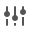 | `Audio Mixer` `Audio Mixer@2x`|
|   | `AutoLightbakingOff` `AutoLightbakingOff@2x`|
|   | `AutoLightbakingOn` `AutoLightbakingOn@2x`|
|  | `AvatarCompass`|
|  | `AvatarController.Layer`|
|  | `AvatarController.LayerHover`|
|  | `AvatarController.LayerSelected`|
|  | `BodyPartPicker`|
|  | `BodySilhouette`|
|  | `DotFill`|
|  | `DotFrame`|
|  | `DotFrameDotted`|
|  | `DotSelection`|
|  | `Head`|
|  | `HeadIk`|
|  | `HeadZoom`|
|  | `HeadZoomSilhouette`|
|  | `LeftArm`|
|  | `LeftFeetIk`|
|  | `LeftFingers`|
|  | `LeftFingersIk`|
|  | `LeftHandZoom`|
|  | `LeftHandZoomSilhouette`|
|  | `LeftLeg`|
|  | `MaskEditor_Root`|
|  | `RightArm`|
|  | `RightFeetIk`|
|  | `RightFingers`|
|  | `RightFingersIk`|
|  | `RightHandZoom`|
|  | `RightHandZoomSilhouette`|
|  | `RightLeg`|
|  | `Torso`|
|   | `AvatarPivot` `AvatarPivot@2x`|
|   | `AvatarSelector` `AvatarSelector@2x`|
|   | `back` `back@2x`|
|  | `beginButton-On`|
|  | `beginButton`|
|   | `blendKey` `blendKey@2x`|
|   | `blendKeyOverlay` `blendKeyOverlay@2x`|
|   | `blendKeySelected` `blendKeySelected@2x`|
|  | `blendSampler`|
|  | `blueGroove`|
|   | `BuildSettings.Android On` `BuildSettings.Android On@2x`|
|   | `BuildSettings.Android` `BuildSettings.Android@2x`|
|   | `BuildSettings.Android.Small` `BuildSettings.Android.Small@2x`|
|  | `BuildSettings.Broadcom`|
|   | `BuildSettings.DedicatedServer On` `BuildSettings.DedicatedServer On@2x`|
|   | `BuildSettings.DedicatedServer` `BuildSettings.DedicatedServer@2x`|
|   | `BuildSettings.DedicatedServer.Small` `BuildSettings.DedicatedServer.Small@2x`|
|  | `BuildSettings.Editor`|
|  | `BuildSettings.Editor.Small`|
|   | `BuildSettings.EmbeddedLinux On` `BuildSettings.EmbeddedLinux On@2x`|
|   | `BuildSettings.EmbeddedLinux` `BuildSettings.EmbeddedLinux@2x`|
|   | `BuildSettings.EmbeddedLinux.Small` `BuildSettings.EmbeddedLinux.Small@2x`|
|   | `BuildSettings.Facebook On` `BuildSettings.Facebook On@2x`|
|   | `BuildSettings.Facebook` `BuildSettings.Facebook@2x`|
|   | `BuildSettings.Facebook.Small` `BuildSettings.Facebook.Small@2x`|
|  | `BuildSettings.FlashPlayer`|
|  | `BuildSettings.FlashPlayer.Small`|
|   | `BuildSettings.GameCoreScarlett On` `BuildSettings.GameCoreScarlett On@2x`|
|   | `BuildSettings.GameCoreScarlett` `BuildSettings.GameCoreScarlett@2x`|
|   | `BuildSettings.GameCoreScarlett.Small` `BuildSettings.GameCoreScarlett.Small@2x`|
|   | `BuildSettings.GameCoreXboxOne On` `BuildSettings.GameCoreXboxOne On@2x`|
|   | `BuildSettings.GameCoreXboxOne` `BuildSettings.GameCoreXboxOne@2x`|
|   | `BuildSettings.GameCoreXboxOne.Small` `BuildSettings.GameCoreXboxOne.Small@2x`|
|   | `BuildSettings.iPhone On` `BuildSettings.iPhone On@2x`|
|   | `BuildSettings.iPhone` `BuildSettings.iPhone@2x`|
|   | `BuildSettings.iPhone.Small` `BuildSettings.iPhone.Small@2x`|
|   | `BuildSettings.LinuxHeadlessSimulation On` `BuildSettings.LinuxHeadlessSimulation On@2x`|
|   | `BuildSettings.LinuxHeadlessSimulation` `BuildSettings.LinuxHeadlessSimulation@2x`|
|   | `BuildSettings.LinuxHeadlessSimulation.Small` `BuildSettings.LinuxHeadlessSimulation.Small@2x`|
|   | `BuildSettings.Lumin On` `BuildSettings.Lumin On@2x`|
|   | `BuildSettings.Lumin` `BuildSettings.Lumin@2x`|
|   | `BuildSettings.Lumin.small` `BuildSettings.Lumin.small@2x`|
|   | `BuildSettings.Metro On` `BuildSettings.Metro On@2x`|
|   | `BuildSettings.Metro` `BuildSettings.Metro@2x`|
|   | `BuildSettings.Metro.Small` `BuildSettings.Metro.Small@2x`|
|   | `BuildSettings.N3DS On` `BuildSettings.N3DS On@2x`|
|   | `BuildSettings.N3DS` `BuildSettings.N3DS@2x`|
|   | `BuildSettings.N3DS.Small` `BuildSettings.N3DS.Small@2x`|
|   | `BuildSettings.PS4 On` `BuildSettings.PS4 On@2x`|
|   | `BuildSettings.PS4` `BuildSettings.PS4@2x`|
|   | `BuildSettings.PS4.Small` `BuildSettings.PS4.Small@2x`|
|   | `BuildSettings.PS5 On` `BuildSettings.PS5 On@2x`|
|   | `BuildSettings.PS5` `BuildSettings.PS5@2x`|
|   | `BuildSettings.PS5.Small` `BuildSettings.PS5.Small@2x`|
|  | `BuildSettings.PSM`|
|  | `BuildSettings.PSM.Small`|
|  | `BuildSettings.PSP2`|
|  | `BuildSettings.PSP2.Small`|
|   | `BuildSettings.QNX On` `BuildSettings.QNX On@2x`|
|   | `BuildSettings.QNX` `BuildSettings.QNX@2x`|
|   | `BuildSettings.QNX.Small` `BuildSettings.QNX.Small@2x`|
|  | `BuildSettings.SelectedIcon`|
|   | `BuildSettings.Stadia On` `BuildSettings.Stadia On@2x`|
|   | `BuildSettings.Stadia` `BuildSettings.Stadia@2x`|
|  | `BuildSettings.Stadia.small`|
|  | `BuildSettings.Stadia.Small@2x`|
|   | `BuildSettings.Standalone On` `BuildSettings.Standalone On@2x`|
|   | `BuildSettings.Standalone` `BuildSettings.Standalone@2x`|
|   | `BuildSettings.Standalone.Small` `BuildSettings.Standalone.Small@2x`|
|  | `BuildSettings.StandaloneBroadcom.Small`|
|  | `BuildSettings.StandaloneGLES20Emu.Small`|
|  | `BuildSettings.StandaloneGLESEmu`|
|  | `BuildSettings.StandaloneGLESEmu.Small`|
|   | `BuildSettings.Switch On` `BuildSettings.Switch On@2x`|
|   | `BuildSettings.Switch` `BuildSettings.Switch@2x`|
|   | `BuildSettings.Switch.Small` `BuildSettings.Switch.Small@2x`|
|   | `BuildSettings.tvOS On` `BuildSettings.tvOS On@2x`|
|   | `BuildSettings.tvOS` `BuildSettings.tvOS@2x`|
|   | `BuildSettings.tvOS.Small` `BuildSettings.tvOS.Small@2x`|
|   | `BuildSettings.visionOS On` `BuildSettings.visionOS On@2x`|
|   | `BuildSettings.visionOS` `BuildSettings.visionOS@2x`|
|   | `BuildSettings.visionOS.small` `BuildSettings.visionOS.small@2x`|
|  | `BuildSettings.Web`|
|  | `BuildSettings.Web.Small`|
|   | `BuildSettings.WebGL On` `BuildSettings.WebGL On@2x`|
|   | `BuildSettings.WebGL` `BuildSettings.WebGL@2x`|
|   | `BuildSettings.WebGL.Small` `BuildSettings.WebGL.Small@2x`|
|  | `BuildSettings.WP8`|
|  | `BuildSettings.WP8.Small`|
|  | `BuildSettings.Xbox360`|
|  | `BuildSettings.Xbox360.Small`|
|   | `BuildSettings.XboxOne On` `BuildSettings.XboxOne On@2x`|
|   | `BuildSettings.XboxOne` `BuildSettings.XboxOne@2x`|
|   | `BuildSettings.XboxOne.Small` `BuildSettings.XboxOne.Small@2x`|
|   | `CacheServerConnected` `CacheServerConnected@2x`|
|   | `CacheServerDisabled` `CacheServerDisabled@2x`|
|   | `CacheServerDisconnected` `CacheServerDisconnected@2x`|
|  | `CheckerFloor`|
|  | `Clipboard`|
|  | `ClothInspector.PaintTool`|
|  | `ClothInspector.PaintValue`|
|  | `ClothInspector.SelectTool`|
|  | `ClothInspector.SettingsTool`|
|  | `ClothInspector.ViewValue`|
|   | `CloudConnect` `CloudConnect@2x`|
|  | `Collab.Build`|
|  | `Collab.BuildFailed`|
|  | `Collab.BuildSucceeded`|
|  | `Collab.FileAdded`|
|  | `Collab.FileConflict`|
|  | `Collab.FileDeleted`|
|  | `Collab.FileIgnored`|
|  | `Collab.FileMoved`|
|  | `Collab.FileUpdated`|
|  | `Collab.FolderAdded`|
|  | `Collab.FolderConflict`|
|  | `Collab.FolderDeleted`|
| 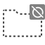 | `Collab.FolderIgnored`|
|  | `Collab.FolderMoved`|
|  | `Collab.FolderUpdated`|
|  | `Collab.NoInternet`|
|   | `Collab` `Collab@2x`|
|  | `Collab.Warning`|
|  | `CollabConflict`|
|  | `CollabError`|
|  | `CollabNew`|
|  | `CollabOffline`|
|  | `CollabProgress`|
|  | `CollabPull`|
|  | `CollabPush`|
|  | `ColorPicker.ColorCycle`|
|  | `ColorPicker.CycleColor`|
|  | `ColorPicker.CycleSlider`|
|  | `ColorPicker.SliderCycle`|
|   | `console.erroricon.inactive.sml` `console.erroricon.inactive.sml@2x`|
|   | `console.erroricon` `console.erroricon@2x`|
|   | `console.erroricon.sml` `console.erroricon.sml@2x`|
|   | `console.infoicon.inactive.sml` `console.infoicon.inactive.sml@2x`|
|   | `console.infoicon` `console.infoicon@2x`|
|   | `console.infoicon.sml` `console.infoicon.sml@2x`|
|   | `console.warnicon.inactive.sml` `console.warnicon.inactive.sml@2x`|
|   | `console.warnicon` `console.warnicon@2x`|
|   | `console.warnicon.sml` `console.warnicon.sml@2x`|
|   | `CreateAddNew` `CreateAddNew@2x`|
|  | `CrossIcon`|
|   | `curvekeyframe` `curvekeyframe@2x`|
|   | `curvekeyframeselected` `curvekeyframeselected@2x`|
|   | `curvekeyframeselectedoverlay` `curvekeyframeselectedoverlay@2x`|
|   | `curvekeyframesemiselectedoverlay` `curvekeyframesemiselectedoverlay@2x`|
|   | `curvekeyframeweighted` `curvekeyframeweighted@2x`|
|  | `CustomSorting`|
|   | `CustomTool` `CustomTool@2x`|
|   | `d__Help` `d__Help@2x`|
|   | `d__Menu` `d__Menu@2x`|
|   | `d__Popup` `d__Popup@2x`|
|   | `d_aboutwindow.mainheader` `d_aboutwindow.mainheader@2x`|
|  | `d_ageialogo`|
|   | `d_AlphabeticalSorting` `d_AlphabeticalSorting@2x`|
|   | `d_AnchorTransformTool On` `d_AnchorTransformTool On@2x`|
|   | `d_AnchorTransformTool` `d_AnchorTransformTool@2x`|
|   | `d_Animation.AddEvent` `d_Animation.AddEvent@2x`|
|   | `d_Animation.AddKeyframe` `d_Animation.AddKeyframe@2x`|
|   | `d_Animation.EventMarker` `d_Animation.EventMarker@2x`|
|   | `d_Animation.FilterBySelection` `d_Animation.FilterBySelection@2x`|
|   | `d_Animation.FirstKey` `d_Animation.FirstKey@2x`|
|   | `d_Animation.LastKey` `d_Animation.LastKey@2x`|
|   | `d_Animation.NextKey` `d_Animation.NextKey@2x`|
|   | `d_Animation.Play` `d_Animation.Play@2x`|
|   | `d_Animation.PrevKey` `d_Animation.PrevKey@2x`|
|   | `d_Animation.Record` `d_Animation.Record@2x`|
|  | `d_Animation.SequencerLink`|
|   | `d_animationanimated` `d_animationanimated@2x`|
|   | `d_animationkeyframe` `d_animationkeyframe@2x`|
|  | `d_animationnocurve`|
|   | `d_animationvisibilitytoggleoff` `d_animationvisibilitytoggleoff@2x`|
|   | `d_animationvisibilitytoggleon` `d_animationvisibilitytoggleon@2x`|
|  | `d_AnimationWrapModeMenu`|
|  | `d_AS Badge Delete`|
|  | `d_AS Badge New`|
|  | `d_AssemblyLock`|
|   | `d_Asset Store` `d_Asset Store@2x`|
|   | `d_Audio Mixer` `d_Audio Mixer@2x`|
|   | `d_AutoLightbakingOff` `d_AutoLightbakingOff@2x`|
|   | `d_AutoLightbakingOn` `d_AutoLightbakingOn@2x`|
|  | `d_AvatarBlendBackground`|
|  | `d_AvatarBlendLeft`|
|  | `d_AvatarBlendLeftA`|
|  | `d_AvatarBlendRight`|
|  | `d_AvatarBlendRightA`|
|  | `d_AvatarCompass`|
|   | `d_AvatarPivot` `d_AvatarPivot@2x`|
|   | `d_AvatarSelector` `d_AvatarSelector@2x`|
|   | `d_back` `d_back@2x`|
|  | `d_beginButton-On`|
|  | `d_beginButton`|
|  | `d_blueGroove`|
|   | `d_BuildSettings.Android` `d_BuildSettings.Android@2x`|
|   | `d_BuildSettings.Android.Small` `d_BuildSettings.Android.Small@2x`|
|  | `d_BuildSettings.Broadcom`|
|   | `d_BuildSettings.DedicatedServer` `d_BuildSettings.DedicatedServer@2x`|
|   | `d_BuildSettings.DedicatedServer.Small` `d_BuildSettings.DedicatedServer.Small@2x`|
|   | `d_BuildSettings.Facebook` `d_BuildSettings.Facebook@2x`|
|   | `d_BuildSettings.Facebook.Small` `d_BuildSettings.Facebook.Small@2x`|
|  | `d_BuildSettings.FlashPlayer`|
|  | `d_BuildSettings.FlashPlayer.Small`|
|   | `d_BuildSettings.GameCoreScarlett` `d_BuildSettings.GameCoreScarlett@2x`|
|   | `d_BuildSettings.GameCoreScarlett.Small` `d_BuildSettings.GameCoreScarlett.Small@2x`|
|   | `d_BuildSettings.GameCoreXboxOne` `d_BuildSettings.GameCoreXboxOne@2x`|
|   | `d_BuildSettings.GameCoreXboxOne.Small` `d_BuildSettings.GameCoreXboxOne.Small@2x`|
|   | `d_BuildSettings.iPhone` `d_BuildSettings.iPhone@2x`|
|   | `d_BuildSettings.iPhone.Small` `d_BuildSettings.iPhone.Small@2x`|
|   | `d_BuildSettings.LinuxHeadlessSimulation` `d_BuildSettings.LinuxHeadlessSimulation@2x`|
|   | `d_BuildSettings.LinuxHeadlessSimulation.Small` `d_BuildSettings.LinuxHeadlessSimulation.Small@2x`|
|   | `d_BuildSettings.Lumin` `d_BuildSettings.Lumin@2x`|
|   | `d_BuildSettings.Lumin.small` `d_BuildSettings.Lumin.small@2x`|
|   | `d_BuildSettings.Metro` `d_BuildSettings.Metro@2x`|
|   | `d_BuildSettings.Metro.Small` `d_BuildSettings.Metro.Small@2x`|
|   | `d_BuildSettings.N3DS` `d_BuildSettings.N3DS@2x`|
|   | `d_BuildSettings.N3DS.Small` `d_BuildSettings.N3DS.Small@2x`|
|   | `d_BuildSettings.PS4` `d_BuildSettings.PS4@2x`|
|   | `d_BuildSettings.PS4.Small` `d_BuildSettings.PS4.Small@2x`|
|   | `d_BuildSettings.PS5` `d_BuildSettings.PS5@2x`|
|   | `d_BuildSettings.PS5.Small` `d_BuildSettings.PS5.Small@2x`|
|  | `d_BuildSettings.PSP2`|
|  | `d_BuildSettings.PSP2.Small`|
|  | `d_BuildSettings.SelectedIcon`|
|   | `d_BuildSettings.Stadia` `d_BuildSettings.Stadia@2x`|
|   | `d_BuildSettings.Stadia.Small` `d_BuildSettings.Stadia.Small@2x`|
|   | `d_BuildSettings.Standalone` `d_BuildSettings.Standalone@2x`|
|   | `d_BuildSettings.Standalone.Small` `d_BuildSettings.Standalone.Small@2x`|
|   | `d_BuildSettings.Switch` `d_BuildSettings.Switch@2x`|
|   | `d_BuildSettings.Switch.Small` `d_BuildSettings.Switch.Small@2x`|
|   | `d_BuildSettings.tvOS` `d_BuildSettings.tvOS@2x`|
|   | `d_BuildSettings.tvOS.Small` `d_BuildSettings.tvOS.Small@2x`|
|   | `d_BuildSettings.visionOS` `d_BuildSettings.visionOS@2x`|
|   | `d_BuildSettings.visionOS.Small` `d_BuildSettings.visionOS.Small@2x`|
|  | `d_BuildSettings.Web`|
|  | `d_BuildSettings.Web.Small`|
|   | `d_BuildSettings.WebGL` `d_BuildSettings.WebGL@2x`|
|   | `d_BuildSettings.WebGL.Small` `d_BuildSettings.WebGL.Small@2x`|
|  | `d_BuildSettings.Xbox360`|
|  | `d_BuildSettings.Xbox360.Small`|
|   | `d_BuildSettings.XboxOne` `d_BuildSettings.XboxOne@2x`|
|   | `d_BuildSettings.XboxOne.Small` `d_BuildSettings.XboxOne.Small@2x`|
|   | `d_BuildSettings.Xiaomi` `d_BuildSettings.Xiaomi@2x`|
|   | `d_BuildSettings.Xiaomi.Small` `d_BuildSettings.Xiaomi.Small@2x`|
|   | `d_CacheServerConnected` `d_CacheServerConnected@2x`|
|   | `d_CacheServerDisabled` `d_CacheServerDisabled@2x`|
|   | `d_CacheServerDisconnected` `d_CacheServerDisconnected@2x`|
|  | `d_CheckerFloor`|
|   | `d_CloudConnect` `d_CloudConnect@2x`|
|  | `d_Collab.FileAdded`|
|  | `d_Collab.FileConflict`|
|  | `d_Collab.FileDeleted`|
|  | `d_Collab.FileIgnored`|
|  | `d_Collab.FileMoved`|
|  | `d_Collab.FileUpdated`|
|  | `d_Collab.FolderAdded`|
|  | `d_Collab.FolderConflict`|
|  | `d_Collab.FolderDeleted`|
| 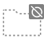 | `d_Collab.FolderIgnored`|
|  | `d_Collab.FolderMoved`|
|  | `d_Collab.FolderUpdated`|
|   | `d_Collab` `d_Collab@2x`|
|  | `d_ColorPicker.CycleColor`|
|  | `d_ColorPicker.CycleSlider`|
|   | `d_console.erroricon.inactive.sml` `d_console.erroricon.inactive.sml@2x`|
|   | `d_console.erroricon` `d_console.erroricon@2x`|
|   | `d_console.erroricon.sml` `d_console.erroricon.sml@2x`|
|   | `d_console.infoicon.inactive.sml` `d_console.infoicon.inactive.sml@2x`|
|   | `d_console.infoicon` `d_console.infoicon@2x`|
|   | `d_console.infoicon.sml` `d_console.infoicon.sml@2x`|
|   | `d_console.warnicon.inactive.sml` `d_console.warnicon.inactive.sml@2x`|
|   | `d_console.warnicon` `d_console.warnicon@2x`|
|   | `d_console.warnicon.sml` `d_console.warnicon.sml@2x`|
|   | `d_CreateAddNew` `d_CreateAddNew@2x`|
|   | `d_curvekeyframe` `d_curvekeyframe@2x`|
|   | `d_curvekeyframeselected` `d_curvekeyframeselected@2x`|
|   | `d_curvekeyframeselectedoverlay` `d_curvekeyframeselectedoverlay@2x`|
|   | `d_curvekeyframesemiselectedoverlay` `d_curvekeyframesemiselectedoverlay@2x`|
|   | `d_curvekeyframeweighted` `d_curvekeyframeweighted@2x`|
|  | `d_CustomSorting`|
|   | `d_CustomTool` `d_CustomTool@2x`|
|   | `d_DataMode.Authoring` `d_DataMode.Authoring@2x`|
|   | `d_DataMode.Authoring.Sticky` `d_DataMode.Authoring.Sticky@2x`|
|   | `d_DataMode.Mixed` `d_DataMode.Mixed@2x`|
|   | `d_DataMode.Mixed.Sticky` `d_DataMode.Mixed.Sticky@2x`|
|   | `d_DataMode.Runtime` `d_DataMode.Runtime@2x`|
|   | `d_DataMode.Runtime.Sticky` `d_DataMode.Runtime.Sticky@2x`|
|   | `d_DebuggerAttached` `d_DebuggerAttached@2x`|
|   | `d_DebuggerDisabled` `d_DebuggerDisabled@2x`|
|   | `d_DebuggerEnabled` `d_DebuggerEnabled@2x`|
|   | `d_DefaultSorting` `d_DefaultSorting@2x`|
|   | `d_DragArrow@2x` `d_DragArrow`|
|  | `d_EditCollider`|
|   | `d_editcollision_16` `d_editcollision_16@2x`|
|  | `d_editcollision_32`|
|   | `d_editconstraints_16` `d_editconstraints_16@2x`|
|  | `d_editconstraints_32`|
|  | `d_editicon.sml`|
|  | `d_endButton-On`|
|  | `d_endButton`|
|   | `d_Exposure` `d_Exposure@2x`|
|   | `d_eyeDropper.Large` `d_eyeDropper.Large@2x`|
|  | `d_eyeDropper.sml`|
|   | `d_Favorite` `d_Favorite@2x`|
|   | `d_Favorite_colored` `d_Favorite_colored@2x`|
|   | `d_Favorite_hover` `d_Favorite_hover@2x`|
|   | `d_FilterByLabel` `d_FilterByLabel@2x`|
|   | `d_FilterByType` `d_FilterByType@2x`|
|   | `d_FilterSelectedOnly` `d_FilterSelectedOnly@2x`|
|   | `d_forward` `d_forward@2x`|
|   | `d_FrameCapture` `d_FrameCapture@2x`|
|  | `d_GEAR`|
|   | `d_GizmosToggle On` `d_GizmosToggle On@2x`|
|   | `d_GizmosToggle` `d_GizmosToggle@2x`|
|   | `d_GreenCheckmark` `d_GreenCheckmark@2x`|
|   | `d_Grid.BoxTool` `d_Grid.BoxTool@2x`|
|   | `d_Grid.Default` `d_Grid.Default@2x`|
|   | `d_Grid.EraserTool` `d_Grid.EraserTool@2x`|
|   | `d_Grid.FillTool` `d_Grid.FillTool@2x`|
|   | `d_Grid.MoveTool` `d_Grid.MoveTool@2x`|
|   | `d_Grid.PaintTool` `d_Grid.PaintTool@2x`|
|   | `d_Grid.PickingTool` `d_Grid.PickingTool@2x`|
|  | `d_Groove`|
|   | `d_HierarchyLock` `d_HierarchyLock@2x`|
|  | `d_HorizontalSplit`|
|   | `d_icon dropdown open` `d_icon dropdown open@2x`|
|   | `d_icon dropdown` `d_icon dropdown@2x`|
|   | `d_Import` `d_Import@2x`|
|  | `d_InspectorLock`|
|   | `d_Invalid` `d_Invalid@2x`|
|  | `d_JointAngularLimits`|
|   | `d_Keyboard` `d_Keyboard@2x`|
|   | `d_KeyboardShortcutsDisabled` `d_KeyboardShortcutsDisabled@2x`|
|  | `d_leftBracket`|
|   | `d_Lighting` `d_Lighting@2x`|
|   | `d_LightmapEditor.WindowTitle` `d_LightmapEditor.WindowTitle@2x`|
|   | `d_Linked` `d_Linked@2x`|
|   | `d_MainStageView` `d_MainStageView@2x`|
|  | `d_Mirror`|
|  | `d_model large`|
|  | `d_monologo`|
|   | `d_MoreOptions` `d_MoreOptions@2x`|
|  | `d_MoveTool on`|
|  | `d_MoveTool On@2x`|
|   | `d_MoveTool` `d_MoveTool@2x`|
|  | `d_Navigation`|
|   | `d_Occlusion` `d_Occlusion@2x`|
|   | `d_Package Manager` `d_Package Manager@2x`|
|  | `d_Particle Effect`|
|     | `d_ParticleShapeTool On` `d_ParticleShapeTool On@2x` `d_ParticleShapeTool On@3x` `d_ParticleShapeTool On@4x`|
|     | `d_ParticleShapeTool` `d_ParticleShapeTool@2x` `d_ParticleShapeTool@3x` `d_ParticleShapeTool@4x`|
|   | `d_PauseButton On` `d_PauseButton On@2x`|
|   | `d_PauseButton` `d_PauseButton@2x`|
|   | `d_PlayButton On` `d_PlayButton On@2x`|
|   | `d_PlayButton` `d_PlayButton@2x`|
|  | `d_PlayButtonProfile On`|
|  | `d_PlayButtonProfile`|
|  | `d_playLoopOff`|
|  | `d_playLoopOn`|
|   | `d_preAudioAutoPlayOff` `d_preAudioAutoPlayOff@2x`|
|  | `d_preAudioAutoPlayOn`|
|   | `d_preAudioLoopOff` `d_preAudioLoopOff@2x`|
|  | `d_preAudioLoopOn`|
|  | `d_preAudioPlayOff`|
|  | `d_preAudioPlayOn`|
|   | `d_PreMatCube` `d_PreMatCube@2x`|
|   | `d_PreMatCylinder` `d_PreMatCylinder@2x`|
|   | `d_PreMatLight0` `d_PreMatLight0@2x`|
|   | `d_PreMatLight1` `d_PreMatLight1@2x`|
|   | `d_PreMatQuad` `d_PreMatQuad@2x`|
|   | `d_PreMatSphere` `d_PreMatSphere@2x`|
|   | `d_PreMatTorus` `d_PreMatTorus@2x`|
|   | `d_Preset.Context` `d_Preset.Context@2x`|
|   | `d_Preset.Current` `d_Preset.Current@2x`|
|   | `d_PreTexA` `d_PreTexA@2x`|
|   | `d_PreTexB` `d_PreTexB@2x`|
|   | `d_PreTexG` `d_PreTexG@2x`|
|   | `d_PreTexR` `d_PreTexR@2x`|
|   | `d_PreTexRGB` `d_PreTexRGB@2x`|
|  | `d_PreTextureAlpha`|
|  | `d_PreTextureMipMapHigh`|
|  | `d_PreTextureMipMapLow`|
|  | `d_PreTextureRGB`|
|   | `d_Profiler.AssetLoading` `d_Profiler.AssetLoading@2x`|
|   | `d_Profiler.Audio` `d_Profiler.Audio@2x`|
|   | `d_Profiler.CPU` `d_Profiler.CPU@2x`|
|   | `d_Profiler.Custom` `d_Profiler.Custom@2x`|
|   | `d_Profiler.FileAccess` `d_Profiler.FileAccess@2x`|
|  | `d_Profiler.FirstFrame`|
|   | `d_Profiler.GlobalIllumination` `d_Profiler.GlobalIllumination@2x`|
|   | `d_Profiler.GPU` `d_Profiler.GPU@2x`|
|  | `d_Profiler.LastFrame`|
|   | `d_Profiler.Memory` `d_Profiler.Memory@2x`|
|  | `d_Profiler.Network`|
|   | `d_Profiler.NetworkMessages` `d_Profiler.NetworkMessages@2x`|
|   | `d_Profiler.NetworkOperations` `d_Profiler.NetworkOperations@2x`|
|  | `d_Profiler.NextFrame`|
|    | `d_Profiler.Open` `d_Profiler.Open@2x` `d_Profiler.Open@4x`|
|   | `d_Profiler.Physics` `d_Profiler.Physics@2x`|
|   | `d_Profiler.Physics2D` `d_Profiler.Physics2D@2x`|
|  | `d_Profiler.PrevFrame`|
|  | `d_Profiler.Record`|
|   | `d_Profiler.Rendering` `d_Profiler.Rendering@2x`|
|   | `d_Profiler.UI` `d_Profiler.UI@2x`|
|   | `d_Profiler.UIDetails` `d_Profiler.UIDetails@2x`|
|   | `d_Profiler.Video` `d_Profiler.Video@2x`|
|   | `d_Profiler.VirtualTexturing` `d_Profiler.VirtualTexturing@2x`|
|  | `d_ProfilerColumn.WarningCount`|
|   | `d_Progress` `d_Progress@2x`|
|   | `d_Project` `d_Project@2x`|
|   | `d_Record Off` `d_Record Off@2x`|
|   | `d_Record On` `d_Record On@2x`|
|   | `d_RectTool On` `d_RectTool On@2x`|
|   | `d_RectTool` `d_RectTool@2x`|
|  | `d_RectTransformBlueprint`|
|  | `d_RectTransformRaw`|
|  | `d_redGroove`|
|   | `d_ReflectionProbeSelector` `d_ReflectionProbeSelector@2x`|
|   | `d_Refresh` `d_Refresh@2x`|
|  | `d_rightBracket`|
|   | `d_RotateTool On` `d_RotateTool On@2x`|
|   | `d_RotateTool` `d_RotateTool@2x`|
|   | `d_SaveAs` `d_SaveAs@2x`|
|   | `d_ScaleTool On` `d_ScaleTool On@2x`|
|   | `d_ScaleTool` `d_ScaleTool@2x`|
|   | `d_Scene` `d_Scene@2x`|
|   | `d_scenepicking_notpickable-mixed` `d_scenepicking_notpickable-mixed@2x`|
|   | `d_scenepicking_notpickable-mixed_hover` `d_scenepicking_notpickable-mixed_hover@2x`|
|   | `d_scenepicking_notpickable` `d_scenepicking_notpickable@2x`|
|   | `d_scenepicking_notpickable_hover` `d_scenepicking_notpickable_hover@2x`|
|   | `d_scenepicking_pickable-mixed` `d_scenepicking_pickable-mixed@2x`|
|   | `d_scenepicking_pickable-mixed_hover` `d_scenepicking_pickable-mixed_hover@2x`|
|   | `d_scenepicking_pickable` `d_scenepicking_pickable@2x`|
|   | `d_scenepicking_pickable_hover` `d_scenepicking_pickable_hover@2x`|
|   | `d_SceneView2D On` `d_SceneView2D On@2x`|
|   | `d_SceneView2D` `d_SceneView2D@2x`|
|  | `d_SceneViewAlpha`|
|   | `d_SceneViewAudio On` `d_SceneViewAudio On@2x`|
|   | `d_SceneViewAudio` `d_SceneViewAudio@2x`|
|   | `d_SceneViewCamera` `d_SceneViewCamera@2x`|
|  | `d_SceneViewFx On`|
|  | `d_SceneViewFX On@2x`|
|  | `d_SceneViewFx`|
|  | `d_SceneViewFX@2x`|
|   | `d_SceneViewLighting On` `d_SceneViewLighting On@2x`|
|   | `d_SceneViewLighting` `d_SceneViewLighting@2x`|
|  | `d_SceneViewOrtho`|
|  | `d_SceneViewRGB`|
|   | `d_SceneViewTools` `d_SceneViewTools@2x`|
|   | `d_SceneViewVisibility On` `d_SceneViewVisibility On@2x`|
|   | `d_SceneViewVisibility` `d_SceneViewVisibility@2x`|
|   | `d_scenevis_hidden-mixed` `d_scenevis_hidden-mixed@2x`|
|   | `d_scenevis_hidden-mixed_hover` `d_scenevis_hidden-mixed_hover@2x`|
|   | `d_scenevis_hidden` `d_scenevis_hidden@2x`|
|   | `d_scenevis_hidden_hover` `d_scenevis_hidden_hover@2x`|
|   | `d_scenevis_scene_hover` `d_scenevis_scene_hover@2x`|
|   | `d_scenevis_visible-mixed` `d_scenevis_visible-mixed@2x`|
|   | `d_scenevis_visible-mixed_hover` `d_scenevis_visible-mixed_hover@2x`|
|   | `d_scenevis_visible` `d_scenevis_visible@2x`|
|   | `d_scenevis_visible_hover` `d_scenevis_visible_hover@2x`|
|  | `d_ScrollShadow`|
|   | `d_Settings` `d_Settings@2x`|
|   | `d_SettingsIcon` `d_SettingsIcon@2x`|
|  | `d_ShowPanels`|
|  | `d_SocialNetworks.FacebookShare`|
|  | `d_SocialNetworks.LinkedInShare`|
|  | `d_SocialNetworks.Tweet`|
|  | `d_SocialNetworks.UDNOpen`|
|  | `d_SpeedScale`|
|   | `d_StepButton On` `d_StepButton On@2x`|
|   | `d_StepButton` `d_StepButton@2x`|
|  | `d_StepLeftButton-On`|
|  | `d_StepLeftButton`|
|   | `d_tab_next` `d_tab_next@2x`|
|   | `d_tab_prev` `d_tab_prev@2x`|
|   | `d_TerrainInspector.TerrainToolAdd` `d_TerrainInspector.TerrainToolAdd@2x`|
|  | `d_TerrainInspector.TerrainToolLower On`|
|  | `d_TerrainInspector.TerrainToolLowerAlt`|
|  | `d_TerrainInspector.TerrainToolPlants On`|
|   | `d_TerrainInspector.TerrainToolPlants` `d_TerrainInspector.TerrainToolPlants@2x`|
|  | `d_TerrainInspector.TerrainToolPlantsAlt On`|
|  | `d_TerrainInspector.TerrainToolPlantsAlt`|
|  | `d_TerrainInspector.TerrainToolRaise On`|
|  | `d_TerrainInspector.TerrainToolRaise`|
|  | `d_TerrainInspector.TerrainToolSetheight On`|
|  | `d_TerrainInspector.TerrainToolSetheight`|
|  | `d_TerrainInspector.TerrainToolSetheightAlt On`|
|  | `d_TerrainInspector.TerrainToolSetheightAlt`|
|  | `d_TerrainInspector.TerrainToolSettings On`|
|   | `d_TerrainInspector.TerrainToolSettings` `d_TerrainInspector.TerrainToolSettings@2x`|
|  | `d_TerrainInspector.TerrainToolSmoothHeight On`|
|  | `d_TerrainInspector.TerrainToolSmoothHeight`|
|  | `d_TerrainInspector.TerrainToolSplat On`|
|   | `d_TerrainInspector.TerrainToolSplat` `d_TerrainInspector.TerrainToolSplat@2x`|
|  | `d_TerrainInspector.TerrainToolSplatAlt On`|
|  | `d_TerrainInspector.TerrainToolSplatAlt`|
|  | `d_TerrainInspector.TerrainToolTrees On`|
|   | `d_TerrainInspector.TerrainToolTrees` `d_TerrainInspector.TerrainToolTrees@2x`|
|  | `d_TerrainInspector.TerrainToolTreesAlt On`|
|  | `d_TerrainInspector.TerrainToolTreesAlt`|
|   | `d_Texture2DArray On` `d_Texture2DArray On@2x`|
|   | `d_Texture2DArray` `d_Texture2DArray@2x`|
|   | `d_toggle_searcher_preview_off` `d_toggle_searcher_preview_off@2x`|
|   | `d_toggle_searcher_preview_off_hover` `d_toggle_searcher_preview_off_hover@2x`|
|   | `d_toggle_searcher_preview_on` `d_toggle_searcher_preview_on@2x`|
|   | `d_toggle_searcher_preview_on_hover` `d_toggle_searcher_preview_on_hover@2x`|
|   | `d_ToggleUVOverlay` `d_ToggleUVOverlay@2x`|
|   | `d_Toolbar Minus` `d_Toolbar Minus@2x`|
|   | `d_Toolbar Plus More` `d_Toolbar Plus More@2x`|
|   | `d_Toolbar Plus` `d_Toolbar Plus@2x`|
|   | `d_ToolHandleCenter` `d_ToolHandleCenter@2x`|
|   | `d_ToolHandleGlobal` `d_ToolHandleGlobal@2x`|
|   | `d_ToolHandleLocal` `d_ToolHandleLocal@2x`|
|   | `d_ToolHandlePivot` `d_ToolHandlePivot@2x`|
|  | `d_ToolsIcon`|
|  | `d_tranp`|
|   | `d_TransformTool On` `d_TransformTool On@2x`|
|   | `d_TransformTool` `d_TransformTool@2x`|
|  | `d_tree_icon`|
| 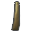 | `d_tree_icon_branch`|
|  | `d_tree_icon_branch_frond`|
|  | `d_tree_icon_frond`|
|  | `d_tree_icon_leaf`|
|  | `d_TreeEditor.AddBranches`|
|  | `d_TreeEditor.AddLeaves`|
|  | `d_TreeEditor.Branch On`|
|  | `d_TreeEditor.Branch`|
|  | `d_TreeEditor.BranchFreeHand On`|
|  | `d_TreeEditor.BranchFreeHand`|
|  | `d_TreeEditor.BranchRotate On`|
|  | `d_TreeEditor.BranchRotate`|
|  | `d_TreeEditor.BranchScale On`|
|  | `d_TreeEditor.BranchScale`|
|  | `d_TreeEditor.BranchTranslate On`|
|  | `d_TreeEditor.BranchTranslate`|
|  | `d_TreeEditor.Distribution On`|
|  | `d_TreeEditor.Distribution`|
|  | `d_TreeEditor.Duplicate`|
|  | `d_TreeEditor.Geometry On`|
|  | `d_TreeEditor.Geometry`|
|  | `d_TreeEditor.Leaf On`|
|  | `d_TreeEditor.Leaf`|
|  | `d_TreeEditor.LeafFreeHand On`|
|  | `d_TreeEditor.LeafFreeHand`|
|  | `d_TreeEditor.LeafRotate On`|
|  | `d_TreeEditor.LeafRotate`|
|  | `d_TreeEditor.LeafScale On`|
|  | `d_TreeEditor.LeafScale`|
|  | `d_TreeEditor.LeafTranslate On`|
|  | `d_TreeEditor.LeafTranslate`|
|  | `d_TreeEditor.Material On`|
|  | `d_TreeEditor.Material`|
|  | `d_TreeEditor.Refresh`|
|  | `d_TreeEditor.Trash`|
|  | `d_TreeEditor.Wind On`|
|  | `d_TreeEditor.Wind`|
|   | `d_UndoHistory` `d_UndoHistory@2x`|
|   | `d_UnityEditor.AnimationWindow` `d_UnityEditor.AnimationWindow@2x`|
|   | `d_UnityEditor.ConsoleWindow` `d_UnityEditor.ConsoleWindow@2x`|
|  | `d_UnityEditor.DebugInspectorWindow`|
|   | `d_UnityEditor.DeviceSimulation.SimulatorWindow` `d_UnityEditor.DeviceSimulation.SimulatorWindow@2x`|
|  | `d_UnityEditor.FindDependencies`|
|   | `d_UnityEditor.GameView` `d_UnityEditor.GameView@2x`|
|   | `d_UnityEditor.Graphs.AnimatorControllerTool` `d_UnityEditor.Graphs.AnimatorControllerTool@2x`|
|  | `d_UnityEditor.HierarchyWindow`|
|   | `d_UnityEditor.HistoryWindow` `d_UnityEditor.HistoryWindow@2x`|
|   | `d_UnityEditor.InspectorWindow` `d_UnityEditor.InspectorWindow@2x`|
|   | `d_UnityEditor.ProfilerWindow` `d_UnityEditor.ProfilerWindow@2x`|
|   | `d_UnityEditor.SceneHierarchyWindow` `d_UnityEditor.SceneHierarchyWindow@2x`|
|   | `d_UnityEditor.SceneView` `d_UnityEditor.SceneView@2x`|
|   | `d_UnityEditor.Timeline.TimelineWindow` `d_UnityEditor.Timeline.TimelineWindow@2x`|
|   | `d_UnityEditor.VersionControl` `d_UnityEditor.VersionControl@2x`|
|  | `d_UnityLogo`|
|   | `d_Unlinked` `d_Unlinked@2x`|
|   | `d_Valid` `d_Valid@2x`|
|  | `d_VerticalSplit`|
|   | `d_ViewToolMove On` `d_ViewToolMove On@2x`|
|   | `d_ViewToolMove` `d_ViewToolMove@2x`|
|   | `d_ViewToolOrbit On` `d_ViewToolOrbit On@2x`|
|   | `d_ViewToolOrbit` `d_ViewToolOrbit@2x`|
|   | `d_ViewToolZoom On` `d_ViewToolZoom On@2x`|
|   | `d_ViewToolZoom` `d_ViewToolZoom@2x`|
|  | `d_VisibilityOff`|
|  | `d_VisibilityOn`|
|   | `d_VisualQueryBuilder` `d_VisualQueryBuilder@2x`|
|  | `d_VUMeterTextureHorizontal`|
|  | `d_VUMeterTextureVertical`|
|  | `d_WaitSpin00`|
|  | `d_WaitSpin01`|
|  | `d_WaitSpin02`|
|  | `d_WaitSpin03`|
|  | `d_WaitSpin04`|
|  | `d_WaitSpin05`|
|  | `d_WaitSpin06`|
|  | `d_WaitSpin07`|
|  | `d_WaitSpin08`|
|  | `d_WaitSpin09`|
|  | `d_WaitSpin10`|
|  | `d_WaitSpin11`|
|  | `d_WelcomeScreen.AssetStoreLogo`|
|  | `d_winbtn_graph`|
|  | `d_winbtn_graph_close_h`|
|  | `d_winbtn_graph_max_h`|
|  | `d_winbtn_graph_min_h`|
|   | `d_winbtn_mac_close` `d_winbtn_mac_close@2x`|
|   | `d_winbtn_mac_close_a` `d_winbtn_mac_close_a@2x`|
|   | `d_winbtn_mac_close_h` `d_winbtn_mac_close_h@2x`|
|  | `d_winbtn_mac_inact`|
|   | `d_winbtn_mac_max` `d_winbtn_mac_max@2x`|
|   | `d_winbtn_mac_max_a` `d_winbtn_mac_max_a@2x`|
|   | `d_winbtn_mac_max_h` `d_winbtn_mac_max_h@2x`|
|   | `d_winbtn_mac_min` `d_winbtn_mac_min@2x`|
|   | `d_winbtn_mac_min_a` `d_winbtn_mac_min_a@2x`|
|   | `d_winbtn_mac_min_h` `d_winbtn_mac_min_h@2x`|
|   | `d_winbtn_win_close` `d_winbtn_win_close@2x`|
|   | `d_winbtn_win_close_a` `d_winbtn_win_close_a@2x`|
|   | `d_winbtn_win_close_h` `d_winbtn_win_close_h@2x`|
|   | `d_winbtn_win_max` `d_winbtn_win_max@2x`|
|   | `d_winbtn_win_max_a` `d_winbtn_win_max_a@2x`|
|   | `d_winbtn_win_max_h` `d_winbtn_win_max_h@2x`|
|  | `d_winbtn_win_min`|
|  | `d_winbtn_win_min_a`|
|  | `d_winbtn_win_min_h`|
|  | `d_winbtn_win_rest`|
|  | `d_winbtn_win_rest_a`|
|  | `d_winbtn_win_rest_h`|
|   | `d_winbtn_win_restore` `d_winbtn_win_restore@2x`|
|   | `d_winbtn_win_restore_a` `d_winbtn_win_restore_a@2x`|
|   | `d_winbtn_win_restore_h` `d_winbtn_win_restore_h@2x`|
|   | `DataMode.Authoring` `DataMode.Authoring@2x`|
|   | `DataMode.Authoring.Sticky` `DataMode.Authoring.Sticky@2x`|
|   | `DataMode.Mixed` `DataMode.Mixed@2x`|
|   | `DataMode.Mixed.Sticky` `DataMode.Mixed.Sticky@2x`|
|   | `DataMode.Runtime` `DataMode.Runtime@2x`|
|   | `DataMode.Runtime.Sticky` `DataMode.Runtime.Sticky@2x`|
|   | `Debug_Frame_d` `Debug_Frame_d@2x`|
|   | `DebuggerAttached` `DebuggerAttached@2x`|
|   | `DebuggerDisabled` `DebuggerDisabled@2x`|
| 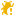  | `DebuggerEnabled` `DebuggerEnabled@2x`|
|   | `DefaultSorting` `DefaultSorting@2x`|
|   | `DragArrow@2x` `DragArrow`|
|  | `EditCollider`|
|   | `editcollision_16` `editcollision_16@2x`|
|  | `editcollision_32`|
|   | `editconstraints_16` `editconstraints_16@2x`|
|  | `editconstraints_32`|
|  | `editicon.sml`|
|  | `endButton-On`|
|  | `endButton`|
|   | `Exposure` `Exposure@2x`|
|   | `eyeDropper.Large` `eyeDropper.Large@2x`|
|  | `eyeDropper.sml`|
|   | `Favorite` `Favorite@2x`|
|   | `Favorite_colored` `Favorite_colored@2x`|
|   | `FilterByLabel` `FilterByLabel@2x`|
|   | `FilterByType` `FilterByType@2x`|
|   | `FilterSelectedOnly` `FilterSelectedOnly@2x`|
|   | `forward` `forward@2x`|
|   | `FrameCapture On` `FrameCapture On@2x`|
|   | `FrameCapture` `FrameCapture@2x`|
|  | `GEAR`|
|   | `GizmosToggle On` `GizmosToggle On@2x`|
|   | `GizmosToggle` `GizmosToggle@2x`|
|   | `GreenCheckmark` `GreenCheckmark@2x`|
|   | `Grid.BoxTool` `Grid.BoxTool@2x`|
|   | `Grid.Default` `Grid.Default@2x`|
|   | `Grid.EraserTool` `Grid.EraserTool@2x`|
|   | `Grid.FillTool` `Grid.FillTool@2x`|
|   | `Grid.MoveTool` `Grid.MoveTool@2x`|
|   | `Grid.PaintTool` `Grid.PaintTool@2x`|
|   | `Grid.PickingTool` `Grid.PickingTool@2x`|
|  | `Groove`|
|  | `align_horizontally`|
|  | `align_horizontally_center`|
|  | `align_horizontally_center_active`|
|  | `align_horizontally_left`|
|  | `align_horizontally_left_active`|
|  | `align_horizontally_right`|
|  | `align_horizontally_right_active`|
|  | `align_vertically`|
|  | `align_vertically_bottom`|
|  | `align_vertically_bottom_active`|
|  | `align_vertically_center`|
|  | `align_vertically_center_active`|
|  | `align_vertically_top`|
|  | `align_vertically_top_active`|
|  | `d_align_horizontally`|
|  | `d_align_horizontally_center`|
|  | `d_align_horizontally_center_active`|
|  | `d_align_horizontally_left`|
|  | `d_align_horizontally_left_active`|
|  | `d_align_horizontally_right`|
|  | `d_align_horizontally_right_active`|
|  | `d_align_vertically`|
|  | `d_align_vertically_bottom`|
|  | `d_align_vertically_bottom_active`|
|  | `d_align_vertically_center`|
|  | `d_align_vertically_center_active`|
|  | `d_align_vertically_top`|
|  | `d_align_vertically_top_active`|
|   | `HierarchyLock` `HierarchyLock@2x`|
|  | `HorizontalSplit`|
|   | `icon dropdown open` `icon dropdown open@2x`|
|   | `icon dropdown` `icon dropdown@2x`|
|   | `Import` `Import@2x`|
|  | `InspectorLock`|
|   | `Invalid` `Invalid@2x`|
|  | `JointAngularLimits`|
|   | `Keyboard` `Keyboard@2x`|
|   | `KeyboardShortcutsDisabled` `KeyboardShortcutsDisabled@2x`|
|  | `KnobCShape`|
|  | `KnobCShapeMini`|
|  | `leftBracket`|
|   | `Lighting` `Lighting@2x`|
|   | `LightmapEditor.WindowTitle` `LightmapEditor.WindowTitle@2x`|
|  | `Lightmapping`|
|  | `d_greenLight`|
|  | `d_lightOff`|
|  | `d_lightRim`|
|  | `d_orangeLight`|
|  | `d_redLight`|
|  | `greenLight`|
|  | `lightOff`|
|  | `lightRim`|
|  | `orangeLight`|
|  | `redLight`|
|   | `Linked` `Linked@2x`|
|  | `LockIcon-On`|
|  | `LockIcon`|
|  | `loop`|
|   | `MainStageView` `MainStageView@2x`|
|  | `Mirror`|
|  | `monologo`|
|   | `MoreOptions` `MoreOptions@2x`|
|  | `MoveTool on`|
|  | `MoveTool On@2x`|
|   | `MoveTool` `MoveTool@2x`|
|  | `Navigation`|
|   | `Occlusion` `Occlusion@2x`|
|   | `CameraPreview` `CameraPreview@2x`|
|   | `d_CameraPreview` `d_CameraPreview@2x`|
|   | `d_GridAndSnap` `d_GridAndSnap@2x`|
|   | `d_OrientationGizmo` `d_OrientationGizmo@2x`|
|   | `d_SearchOverlay` `d_SearchOverlay@2x`|
|   | `d_StandardTools` `d_StandardTools@2x`|
|   | `d_ToolSettings` `d_ToolSettings@2x`|
|   | `d_ToolsToggle` `d_ToolsToggle@2x`|
|   | `d_ViewOptions` `d_ViewOptions@2x`|
|   | `GridAndSnap` `GridAndSnap@2x`|
|  | `Grip_HorizontalContainer`|
|  | `Grip_VerticalContainer`|
|  | `HoverBar_Down`|
|  | `HoverBar_LeftRight`|
|  | `HoverBar_Up`|
|       | `Locked` `Locked@2x` `Locked` `Locked@2x` `Locked` `Locked@2x`|
|   | `OrientationGizmo` `OrientationGizmo@2x`|
|   | `SearchOverlay` `SearchOverlay@2x`|
|   | `StandardTools` `StandardTools@2x`|
|   | `ToolSettings` `ToolSettings@2x`|
|   | `ToolsToggle` `ToolsToggle@2x`|
|       | `Unlocked` `Unlocked@2x` `Unlocked` `Unlocked@2x` `Unlocked` `Unlocked@2x`|
|   | `ViewOptions` `ViewOptions@2x`|
|   | `Package Manager` `Package Manager@2x`|
|  | `PackageBadgeNew`|
|  | `PackageBadgeOverride`|
|   | `Feature-Selected` `Feature-Selected@2x`|
|   | `Feature` `Feature@2x`|
|   | `Quickstart` `Quickstart@2x`|
|     | `Add-Available` `Add-Available@2x` `Add-Available` `Add-Available@2x`|
|     | `Cancel` `Cancel@2x` `Cancel` `Cancel@2x`|
|     | `Custom` `Custom@2x` `Custom` `Custom@2x`|
|     | `Customized` `Customized@2x` `Customized` `Customized@2x`|
|     | `Dependency` `Dependency@2x` `Dependency` `Dependency@2x`|
|     | `Download-Available` `Download-Available@2x` `Download-Available` `Download-Available@2x`|
|     | `Error` `Error@2x` `Error` `Error@2x`|
|     | `Folder` `Folder@2x` `Folder` `Folder@2x`|
|     | `Git` `Git@2x` `Git` `Git@2x`|
|     | `Import-Available` `Import-Available@2x` `Import-Available` `Import-Available@2x`|
|     | `Info` `Info@2x` `Info` `Info@2x`|
|     | `Installed` `Installed@2x` `Installed` `Installed@2x`|
|     | `Link` `Link@2x` `Link` `Link@2x`|
|     | `Loading` `Loading@2x` `Loading` `Loading@2x`|
|     | `More` `More@2x` `More` `More@2x`|
|     | `MultiSelectFeature` `MultiSelectFeature@2x` `MultiSelectFeature` `MultiSelectFeature@2x`|
|     | `Package` `Package@2x` `Package` `Package@2x`|
|     | `Pause` `Pause@2x` `Pause` `Pause@2x`|
|     | `Play` `Play@2x` `Play` `Play@2x`|
|       | `Refresh` `Refresh@2x` `Refresh` `Refresh@2x` `Refresh` `Refresh@2x`|
|     | `Update-Available` `Update-Available@2x` `Update-Available` `Update-Available@2x`|
|     | `Warning` `Warning@2x` `Warning` `Warning@2x`|
|   | `Installed-Selected-Focused` `Installed-Selected-Focused@2x`|
|  | `Particle Effect`|
|     | `ParticleShapeTool On` `ParticleShapeTool On@2x` `ParticleShapeTool On@3x` `ParticleShapeTool On@4x`|
|     | `ParticleShapeTool` `ParticleShapeTool@2x` `ParticleShapeTool@3x` `ParticleShapeTool@4x`|
|   | `PauseButton On` `PauseButton On@2x`|
|   | `PauseButton` `PauseButton@2x`|
|   | `PlayButton On` `PlayButton On@2x`|
|   | `PlayButton` `PlayButton@2x`|
|  | `PlayButtonProfile On`|
|  | `PlayButtonProfile`|
|  | `playLoopOff`|
|  | `playLoopOn`|
|  | `playSpeed`|
|   | `preAudioAutoPlayOff` `preAudioAutoPlayOff@2x`|
|  | `preAudioAutoPlayOn`|
|   | `preAudioLoopOff` `preAudioLoopOff@2x`|
|  | `preAudioLoopOn`|
|  | `preAudioPlayOff`|
|  | `preAudioPlayOn`|
|   | `PreMatCube` `PreMatCube@2x`|
|   | `PreMatCylinder` `PreMatCylinder@2x`|
|   | `PreMatLight0` `PreMatLight0@2x`|
|   | `PreMatLight1` `PreMatLight1@2x`|
|   | `PreMatQuad` `PreMatQuad@2x`|
|   | `PreMatSphere` `PreMatSphere@2x`|
|   | `PreMatTorus` `PreMatTorus@2x`|
|   | `Preset.Context` `Preset.Context@2x`|
|   | `Preset.Current` `Preset.Current@2x`|
|   | `PreTexA` `PreTexA@2x`|
|   | `PreTexB` `PreTexB@2x`|
|   | `PreTexG` `PreTexG@2x`|
|   | `PreTexR` `PreTexR@2x`|
|   | `PreTexRGB` `PreTexRGB@2x`|
|  | `PreTextureAlpha`|
|  | `PreTextureArrayFirstSlice`|
|  | `PreTextureArrayLastSlice`|
|  | `PreTextureMipMapHigh`|
|  | `PreTextureMipMapLow`|
|  | `PreTextureRGB`|
|   | `PreviewPackageInUse` `PreviewPackageInUse@2x`|
| 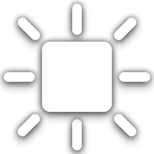 | `AreaLight Gizmo`|
|  | `AreaLight Icon`|
|  | `Assembly Icon`|
|  | `AssetStore Icon`|
|  | `AudioMixerView Icon`|
|  | `AudioSource Gizmo`|
|  | `boo Script Icon`|
|  | `Camera Gizmo`|
|  | `ChorusFilter Icon`|
|  | `CollabChanges Icon`|
|  | `CollabChangesConflict Icon`|
|  | `CollabChangesDeleted Icon`|
|  | `CollabConflict Icon`|
|  | `CollabCreate Icon`|
|  | `CollabDeleted Icon`|
|  | `CollabEdit Icon`|
|  | `CollabExclude Icon`|
|  | `CollabMoved Icon`|
|  | `cs Script Icon`|
|  | `d_AreaLight Icon`|
|  | `d_Assembly Icon`|
|  | `d_AssetStore Icon`|
|  | `d_AudioMixerView Icon`|
|  | `d_boo Script Icon`|
|  | `d_CollabChanges Icon`|
|  | `d_CollabChangesConflict Icon`|
|  | `d_CollabChangesDeleted Icon`|
|  | `d_CollabConflict Icon`|
|  | `d_CollabCreate Icon`|
|  | `d_CollabDeleted Icon`|
|  | `d_CollabEdit Icon`|
|  | `d_CollabExclude Icon`|
|  | `d_CollabMoved Icon`|
|  | `d_cs Script Icon`|
|  | `d_DirectionalLight Icon`|
|  | `d_Favorite Icon`|
|  | `d_Favorite On Icon`|
|  | `d_Folder Icon`|
|  | `d_FolderEmpty Icon`|
|  | `d_FolderEmpty On Icon`|
|  | `d_FolderFavorite Icon`|
|  | `d_FolderFavorite On Icon`|
|  | `d_FolderOpened Icon`|
|   | `d_GridLayoutGroup Icon` `d_GridLayoutGroup Icon`|
|   | `d_HorizontalLayoutGroup Icon` `d_HorizontalLayoutGroup Icon`|
|  | `d_Js Script Icon`|
|  | `d_LightingDataAssetParent Icon`|
| 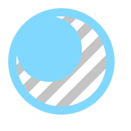 | `d_MaterialVariant Icon`|
|  | `d_Microphone Icon`|
|  | `d_Prefab Icon`|
|  | `d_Prefab On Icon`|
|  | `d_PrefabModel Icon`|
|  | `d_PrefabModel On Icon`|
|  | `d_PrefabOverlayAdded Icon`|
|  | `d_PrefabOverlayAdded On Icon`|
|  | `d_PrefabOverlayRemoved Icon`|
|  | `d_PrefabOverlayRemoved On Icon`|
| 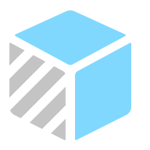 | `d_PrefabVariant Icon`|
|  | `d_PrefabVariant On Icon`|
|  | `d_RaycastCollider Icon`|
|  | `d_Search Icon`|
|  | `d_SearchJump Icon`|
|  | `d_Settings Icon`|
|  | `d_Shortcut Icon`|
|  | `d_Spotlight Icon`|
|   | `d_VerticalLayoutGroup Icon` `d_VerticalLayoutGroup Icon`|
|  | `DefaultSlate Icon`|
|  | `DirectionalLight Gizmo`|
|  | `DirectionalLight Icon`|
|  | `DiscLight Gizmo`|
|  | `DiscLight Icon`|
|  | `dll Script Icon`|
|  | `EchoFilter Icon`|
|  | `Favorite Icon`|
|  | `Favorite On Icon`|
|  | `Folder Icon`|
|  | `Folder On Icon`|
|  | `FolderEmpty Icon`|
|  | `FolderEmpty On Icon`|
|  | `FolderFavorite Icon`|
|  | `FolderFavorite On Icon`|
|  | `FolderOpened Icon`|
|  | `FolderOpened On Icon`|
|  | `GameManager Icon`|
|  | `GridBrush Icon`|
|  | `HighPassFilter Icon`|
|   | `HorizontalLayoutGroup Icon` `HorizontalLayoutGroup Icon`|
|  | `Js Script Icon`|
|  | `LensFlare Gizmo`|
|  | `LightingDataAssetParent Icon`|
| 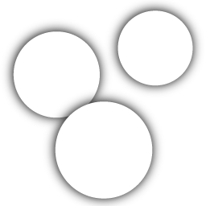 | `LightProbeGroup Gizmo`|
|  | `LightProbeProxyVolume Gizmo`|
| 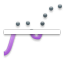 | `LowPassFilter Icon`|
|  | `Main Light Gizmo`|
|  | `MaterialVariant Icon`|
|  | `MetaFile Icon`|
|  | `Microphone Icon`|
|  | `MuscleClip Icon`|
| 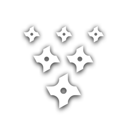 | `ParticleSystem Gizmo`|
|  | `ParticleSystemForceField Gizmo`|
|  | `PointLight Gizmo`|
|  | `Prefab Icon`|
|  | `Prefab On Icon`|
|  | `PrefabModel Icon`|
|  | `PrefabModel On Icon`|
|  | `PrefabOverlayAdded Icon`|
|  | `PrefabOverlayAdded On Icon`|
|  | `PrefabOverlayModified Icon`|
|  | `PrefabOverlayRemoved Icon`|
|  | `PrefabOverlayRemoved On Icon`|
|  | `PrefabVariant Icon`|
|  | `PrefabVariant On Icon`|
| 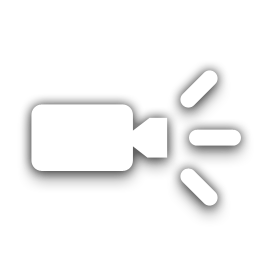 | `Projector Gizmo`|
|  | `RaycastCollider Icon`|
|  | `ReflectionProbe Gizmo`|
|  | `ReverbFilter Icon`|
|  | `SceneSet Icon`|
|  | `Search Icon`|
|  | `Search On Icon`|
|  | `SearchJump Icon`|
|  | `Settings Icon`|
|  | `Shortcut Icon`|
|  | `SoftlockProjectBrowser Icon`|
|  | `SpeedTreeModel Icon`|
| 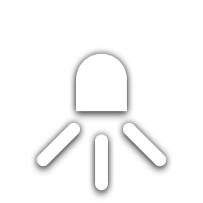 | `SpotLight Gizmo`|
|  | `Spotlight Icon`|
|  | `SpriteCollider Icon`|
|  | `sv_icon_dot0_pix16_gizmo`|
|  | `sv_icon_dot10_pix16_gizmo`|
|  | `sv_icon_dot11_pix16_gizmo`|
|  | `sv_icon_dot12_pix16_gizmo`|
|  | `sv_icon_dot13_pix16_gizmo`|
|  | `sv_icon_dot14_pix16_gizmo`|
|  | `sv_icon_dot15_pix16_gizmo`|
|  | `sv_icon_dot1_pix16_gizmo`|
| 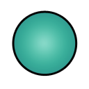 | `sv_icon_dot2_pix16_gizmo`|
|  | `sv_icon_dot3_pix16_gizmo`|
|  | `sv_icon_dot4_pix16_gizmo`|
|  | `sv_icon_dot5_pix16_gizmo`|
|  | `sv_icon_dot6_pix16_gizmo`|
|  | `sv_icon_dot7_pix16_gizmo`|
|  | `sv_icon_dot8_pix16_gizmo`|
|  | `sv_icon_dot9_pix16_gizmo`|
|  | `AnimatorController Icon`|
|  | `AnimatorController On Icon`|
|  | `AnimatorState Icon`|
|  | `AnimatorStateMachine Icon`|
|  | `AnimatorStateTransition Icon`|
|  | `BlendTree Icon`|
| 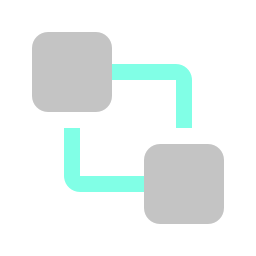 | `d_AnimatorController Icon`|
|  | `d_AnimatorController On Icon`|
|  | `d_AnimatorState Icon`|
|  | `d_AnimatorStateMachine Icon`|
|  | `d_AnimatorStateTransition Icon`|
|  | `d_BlendTree Icon`|
|  | `AnimationWindowEvent Icon`|
|  | `AudioMixerController Icon`|
| 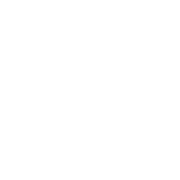 | `AudioMixerController On Icon`|
| 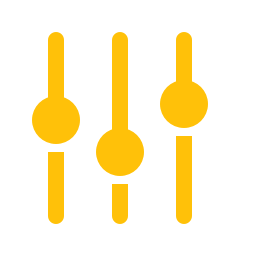 | `d_AudioMixerController Icon`|
|  | `d_AudioMixerController On Icon`|
|  | `AudioImporter Icon`|
|  | `d_AudioImporter Icon`|
|  | `d_DefaultAsset Icon`|
|  | `d_Filter Icon`|
|  | `d_IHVImageFormatImporter Icon`|
|  | `d_LightingDataAsset Icon`|
|  | `d_LightmapParameters Icon`|
|  | `d_LightmapParameters On Icon`|
|  | `d_ModelImporter Icon`|
|  | `d_SceneAsset Icon`|
|  | `d_ShaderImporter Icon`|
|  | `d_ShaderInclude Icon`|
|  | `d_TextScriptImporter Icon`|
|  | `d_TextureImporter Icon`|
|  | `d_TrueTypeFontImporter Icon`|
|  | `DefaultAsset Icon`|
|  | `EditorSettings Icon`|
|  | `Filter Icon`|
|  | `AnyStateNode Icon`|
|  | `d_AnyStateNode Icon`|
|  | `HumanTemplate Icon`|
|  | `IHVImageFormatImporter Icon`|
|  | `LightingDataAsset Icon`|
|  | `LightmapParameters Icon`|
|  | `LightmapParameters On Icon`|
|  | `ModelImporter Icon`|
|  | `Preset Icon`|
|  | `SceneAsset Icon`|
|  | `SceneAsset On Icon`|
|  | `SceneTemplateAsset Icon`|
|  | `d_SearchDatabase Icon`|
|  | `d_SearchQuery Icon`|
|  | `d_SearchQueryAsset Icon`|
|  | `SearchDatabase Icon`|
|  | `SearchQuery Icon`|
|  | `SearchQueryAsset Icon`|
|  | `ShaderImporter Icon`|
|  | `ShaderInclude Icon`|
|  | `SpeedTreeImporter Icon`|
|  | `SubstanceArchive Icon`|
|  | `TextScriptImporter Icon`|
|  | `TextureImporter Icon`|
|  | `TrueTypeFontImporter Icon`|
|  | `d_SpriteAtlasAsset Icon`|
|  | `d_SpriteAtlasImporter Icon`|
|  | `SpriteAtlasAsset Icon`|
|  | `SpriteAtlasImporter Icon`|
|  | `d_VisualEffectSubgraphBlock Icon`|
|  | `d_VisualEffectSubgraphOperator Icon`|
|  | `VisualEffectSubgraphBlock Icon`|
|  | `VisualEffectSubgraphOperator Icon`|
|  | `VideoClipImporter Icon`|
|  | `AssemblyDefinitionAsset Icon`|
|  | `AssemblyDefinitionReferenceAsset Icon`|
|  | `d_AssemblyDefinitionAsset Icon`|
|  | `d_AssemblyDefinitionReferenceAsset Icon`|
|  | `d_NavMeshAgent Icon`|
| 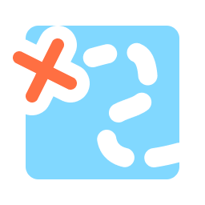 | `d_NavMeshData Icon`|
|  | `d_NavMeshObstacle Icon`|
|  | `d_OffMeshLink Icon`|
|  | `NavMeshAgent Icon`|
| 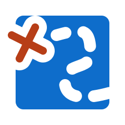 | `NavMeshData Icon`|
|  | `NavMeshObstacle Icon`|
|  | `OffMeshLink Icon`|
|  | `AnalyticsTracker Icon`|
|  | `d_AnalyticsTracker Icon`|
|  | `Animation Icon`|
|  | `AnimationClip Icon`|
|  | `AnimationClip On Icon`|
|  | `AimConstraint Icon`|
|  | `d_AimConstraint Icon`|
|  | `d_LookAtConstraint Icon`|
|  | `d_ParentConstraint Icon`|
|  | `d_PositionConstraint Icon`|
|  | `d_RotationConstraint Icon`|
|  | `d_ScaleConstraint Icon`|
|  | `LookAtConstraint Icon`|
|  | `ParentConstraint Icon`|
|  | `PositionConstraint Icon`|
|  | `RotationConstraint Icon`|
|  | `ScaleConstraint Icon`|
|  | `Animator Icon`|
|  | `AnimatorOverrideController Icon`|
|  | `AnimatorOverrideController On Icon`|
|  | `AreaEffector2D Icon`|
|  | `ArticulationBody Icon`|
|  | `AudioMixerGroup Icon`|
|  | `AudioMixerSnapshot Icon`|
|  | `AudioSpatializerMicrosoft Icon`|
|  | `d_AudioMixerGroup Icon`|
|  | `d_AudioMixerSnapshot Icon`|
|  | `d_AudioSpatializerMicrosoft Icon`|
|  | `AudioChorusFilter Icon`|
|  | `AudioClip Icon`|
|  | `AudioClip On Icon`|
|  | `AudioDistortionFilter Icon`|
|  | `AudioEchoFilter Icon`|
|  | `AudioHighPassFilter Icon`|
|  | `AudioListener Icon`|
|  | `AudioLowPassFilter Icon`|
|  | `AudioReverbFilter Icon`|
|  | `AudioReverbZone Icon`|
|  | `AudioSource Icon`|
|  | `Avatar Icon`|
|  | `AvatarMask Icon`|
|  | `AvatarMask On Icon`|
|  | `BillboardAsset Icon`|
|  | `BillboardRenderer Icon`|
|  | `BoxCollider Icon`|
|  | `BoxCollider2D Icon`|
|  | `BuoyancyEffector2D Icon`|
|  | `Camera Icon`|
|  | `Canvas Icon`|
|  | `CanvasGroup Icon`|
|  | `CanvasRenderer Icon`|
|  | `CapsuleCollider Icon`|
|  | `CapsuleCollider2D Icon`|
|  | `CharacterController Icon`|
|  | `CharacterJoint Icon`|
|  | `CircleCollider2D Icon`|
|  | `Cloth Icon`|
|  | `CompositeCollider2D Icon`|
|  | `ComputeShader Icon`|
|  | `ConfigurableJoint Icon`|
|  | `ConstantForce Icon`|
|  | `ConstantForce2D Icon`|
|  | `Cubemap Icon`|
|  | `CustomCollider2D Icon`|
|  | `d_Animation Icon`|
| 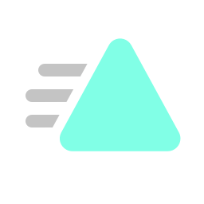 | `d_AnimationClip Icon`|
|  | `d_AnimationClip On Icon`|
|  | `d_Animator Icon`|
| 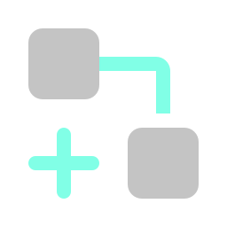 | `d_AnimatorOverrideController Icon`|
|  | `d_AnimatorOverrideController On Icon`|
|  | `d_AreaEffector2D Icon`|
|  | `d_ArticulationBody Icon`|
|  | `d_AudioChorusFilter Icon`|
|  | `d_AudioClip Icon`|
|  | `d_AudioClip On Icon`|
|  | `d_AudioDistortionFilter Icon`|
|  | `d_AudioEchoFilter Icon`|
|  | `d_AudioHighPassFilter Icon`|
|  | `d_AudioListener Icon`|
|  | `d_AudioLowPassFilter Icon`|
|  | `d_AudioReverbFilter Icon`|
|  | `d_AudioReverbZone Icon`|
|  | `d_AudioSource Icon`|
|  | `d_Avatar Icon`|
|  | `d_AvatarMask Icon`|
|  | `d_AvatarMask On Icon`|
|  | `d_BillboardAsset Icon`|
|  | `d_BillboardRenderer Icon`|
|  | `d_BoxCollider Icon`|
|  | `d_BoxCollider2D Icon`|
|  | `d_BuoyancyEffector2D Icon`|
|  | `d_Camera Icon`|
|  | `d_Canvas Icon`|
|  | `d_CanvasGroup Icon`|
|  | `d_CanvasRenderer Icon`|
|  | `d_CapsuleCollider Icon`|
|  | `d_CapsuleCollider2D Icon`|
|  | `d_CharacterController Icon`|
|  | `d_CharacterJoint Icon`|
|  | `d_CircleCollider2D Icon`|
|  | `d_Cloth Icon`|
|  | `d_CompositeCollider2D Icon`|
|  | `d_ComputeShader Icon`|
|  | `d_ConfigurableJoint Icon`|
|  | `d_ConstantForce Icon`|
|  | `d_ConstantForce2D Icon`|
|  | `d_Cubemap Icon`|
|  | `d_DistanceJoint2D Icon`|
|  | `d_EdgeCollider2D Icon`|
|  | `d_FixedJoint Icon`|
|  | `d_Flare Icon`|
|  | `d_Flare On Icon`|
|  | `d_FlareLayer Icon`|
|  | `d_Font Icon`|
|  | `d_FrictionJoint2D Icon`|
|  | `d_GameObject Icon`|
|  | `d_Grid Icon`|
|  | `d_GUISkin Icon`|
|  | `d_GUISkin On Icon`|
|  | `d_Halo Icon`|
|  | `d_HingeJoint Icon`|
|  | `d_HingeJoint2D Icon`|
|  | `d_Light Icon`|
|  | `d_LightingSettings Icon`|
|  | `d_LightProbeGroup Icon`|
|  | `d_LightProbeProxyVolume Icon`|
|  | `d_LightProbes Icon`|
|  | `d_LineRenderer Icon`|
|  | `d_LODGroup Icon`|
|  | `d_Material Icon`|
|  | `d_Material On Icon`|
|  | `d_Mesh Icon`|
|  | `d_MeshCollider Icon`|
|  | `d_MeshFilter Icon`|
|  | `d_MeshRenderer Icon`|
|  | `d_Motion Icon`|
|  | `d_OcclusionArea Icon`|
|  | `d_OcclusionPortal Icon`|
|  | `d_ParticleSystem Icon`|
|  | `d_ParticleSystemForceField Icon`|
|  | `d_PhysicMaterial Icon`|
|  | `d_PhysicMaterial On Icon`|
|  | `d_PhysicsMaterial2D Icon`|
|  | `d_PhysicsMaterial2D On Icon`|
|  | `d_PlatformEffector2D Icon`|
|  | `d_PointEffector2D Icon`|
|  | `d_PolygonCollider2D Icon`|
|  | `d_ProceduralMaterial Icon`|
|  | `d_Projector Icon`|
|  | `d_RayTracingShader Icon`|
|  | `d_RectTransform Icon`|
|  | `d_ReflectionProbe Icon`|
|  | `d_RelativeJoint2D Icon`|
|  | `d_RenderTexture Icon`|
|  | `d_RenderTexture On Icon`|
|  | `d_Rigidbody Icon`|
|  | `d_Rigidbody2D Icon`|
|  | `d_ScriptableObject Icon`|
|  | `d_ScriptableObject On Icon`|
|  | `d_Shader Icon`|
|  | `d_ShaderVariantCollection Icon`|
|  | `d_SkinnedMeshRenderer Icon`|
|  | `d_Skybox Icon`|
|  | `d_SliderJoint2D Icon`|
|  | `d_SphereCollider Icon`|
|  | `d_SpringJoint Icon`|
|  | `d_SpringJoint2D Icon`|
|  | `d_Sprite Icon`|
|  | `d_SpriteMask Icon`|
|  | `d_SpriteRenderer Icon`|
|  | `d_StreamingController Icon`|
|  | `d_SurfaceEffector2D Icon`|
|  | `d_TargetJoint2D Icon`|
|  | `d_Terrain Icon`|
|  | `d_TerrainCollider Icon`|
|  | `d_TerrainData Icon`|
|  | `d_TextAsset Icon`|
|  | `d_Texture Icon`|
|  | `d_Texture2D Icon`|
|  | `d_TrailRenderer Icon`|
|  | `d_Transform Icon`|
|  | `d_WheelCollider Icon`|
|  | `d_WheelJoint2D Icon`|
|  | `d_WindZone Icon`|
|  | `DistanceJoint2D Icon`|
|  | `EdgeCollider2D Icon`|
|  | `d_EventSystem Icon`|
|  | `d_EventTrigger Icon`|
|  | `d_HoloLensInputModule Icon`|
|  | `d_Physics2DRaycaster Icon`|
|  | `d_PhysicsRaycaster Icon`|
|  | `d_StandaloneInputModule Icon`|
|  | `d_TouchInputModule Icon`|
|  | `EventSystem Icon`|
|  | `EventTrigger Icon`|
|  | `HoloLensInputModule Icon`|
|  | `Physics2DRaycaster Icon`|
|  | `PhysicsRaycaster Icon`|
|  | `StandaloneInputModule Icon`|
|  | `TouchInputModule Icon`|
|  | `d_RaytracingShader Icon`|
|   | `RayTracingShader Icon` `RayTracingShader Icon`|
|  | `FixedJoint Icon`|
|  | `FixedJoint2D Icon`|
|  | `Flare Icon`|
|  | `Flare On Icon`|
|  | `FlareLayer Icon`|
|  | `Font Icon`|
|  | `Font On Icon`|
|  | `FrictionJoint2D Icon`|
| 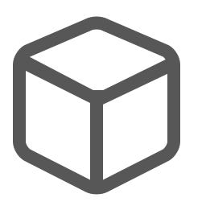 | `GameObject Icon`|
|  | `GameObject On Icon`|
|  | `Grid Icon`|
|  | `GUILayer Icon`|
| 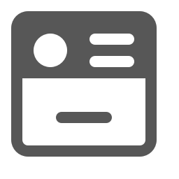 | `GUISkin Icon`|
|  | `GUISkin On Icon`|
|  | `GUIText Icon`|
| 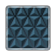 | `GUITexture Icon`|
|  | `Halo Icon`|
|  | `HingeJoint Icon`|
|  | `HingeJoint2D Icon`|
|  | `LensFlare Icon`|
|  | `Light Icon`|
|  | `LightingSettings Icon`|
|  | `LightProbeGroup Icon`|
|  | `LightProbeProxyVolume Icon`|
|  | `LightProbes Icon`|
|  | `LineRenderer Icon`|
|  | `LODGroup Icon`|
|  | `Material Icon`|
|  | `Material On Icon`|
|  | `Mesh Icon`|
|  | `MeshCollider Icon`|
|  | `MeshFilter Icon`|
|  | `MeshRenderer Icon`|
|  | `Motion Icon`|
|  | `MovieTexture Icon`|
|  | `d_NetworkAnimator Icon`|
|  | `d_NetworkDiscovery Icon`|
|  | `d_NetworkIdentity Icon`|
|  | `d_NetworkLobbyManager Icon`|
|  | `d_NetworkLobbyPlayer Icon`|
|  | `d_NetworkManager Icon`|
|  | `d_NetworkManagerHUD Icon`|
|  | `d_NetworkMigrationManager Icon`|
|  | `d_NetworkProximityChecker Icon`|
|  | `d_NetworkStartPosition Icon`|
|  | `d_NetworkTransform Icon`|
|  | `d_NetworkTransformChild Icon`|
|  | `d_NetworkTransformVisualizer Icon`|
|  | `NetworkAnimator Icon`|
|  | `NetworkDiscovery Icon`|
|  | `NetworkIdentity Icon`|
|  | `NetworkLobbyManager Icon`|
|  | `NetworkLobbyPlayer Icon`|
|  | `NetworkManager Icon`|
|  | `NetworkManagerHUD Icon`|
|  | `NetworkMigrationManager Icon`|
|  | `NetworkProximityChecker Icon`|
|  | `NetworkStartPosition Icon`|
|  | `NetworkTransform Icon`|
|  | `NetworkTransformChild Icon`|
|  | `NetworkTransformVisualizer Icon`|
|  | `NetworkView Icon`|
|  | `OcclusionArea Icon`|
|  | `OcclusionPortal Icon`|
|  | `ParticleSystem Icon`|
|  | `ParticleSystemForceField Icon`|
|  | `PhysicMaterial Icon`|
|  | `PhysicMaterial On Icon`|
|  | `PhysicsMaterial2D Icon`|
|  | `PhysicsMaterial2D On Icon`|
|  | `PlatformEffector2D Icon`|
|  | `d_PlayableDirector Icon`|
|  | `PlayableDirector Icon`|
|  | `PointEffector2D Icon`|
|  | `PolygonCollider2D Icon`|
|  | `ProceduralMaterial Icon`|
|  | `Projector Icon`|
|  | `RectTransform Icon`|
|  | `ReflectionProbe Icon`|
|  | `RelativeJoint2D Icon`|
|  | `d_SortingGroup Icon`|
|  | `SortingGroup Icon`|
|  | `RenderTexture Icon`|
|  | `RenderTexture On Icon`|
|  | `Rigidbody Icon`|
|  | `Rigidbody2D Icon`|
|  | `ScriptableObject Icon`|
|  | `ScriptableObject On Icon`|
|  | `Shader Icon`|
|  | `ShaderVariantCollection Icon`|
|  | `SkinnedMeshRenderer Icon`|
|  | `Skybox Icon`|
|  | `SliderJoint2D Icon`|
|  | `TrackedPoseDriver Icon`|
|  | `SphereCollider Icon`|
|  | `SpringJoint Icon`|
|  | `SpringJoint2D Icon`|
|  | `Sprite Icon`|
|  | `SpriteMask Icon`|
|  | `SpriteRenderer Icon`|
|  | `StreamingController Icon`|
|  | `SurfaceEffector2D Icon`|
|  | `TargetJoint2D Icon`|
|  | `Terrain Icon`|
|  | `TerrainCollider Icon`|
|  | `TerrainData Icon`|
|  | `TextAsset Icon`|
|  | `TextMesh Icon`|
|  | `Texture Icon`|
|  | `Texture2D Icon`|
|  | `d_Tile Icon`|
| 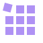 | `d_Tilemap Icon`|
| 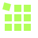 | `d_TilemapCollider2D Icon`|
|  | `d_TilemapRenderer Icon`|
|  | `Tile Icon`|
|  | `Tilemap Icon`|
|  | `TilemapCollider2D Icon`|
|  | `TilemapRenderer Icon`|
|  | `d_SignalAsset Icon`|
|  | `d_SignalEmitter Icon`|
|  | `d_SignalReceiver Icon`|
| 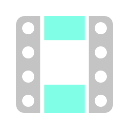 | `d_TimelineAsset Icon`|
|  | `d_TimelineAsset On Icon`|
|  | `SignalAsset Icon`|
|  | `SignalEmitter Icon`|
|  | `SignalReceiver Icon`|
|  | `TimelineAsset Icon`|
|  | `TimelineAsset On Icon`|
|  | `TrailRenderer Icon`|
|  | `Transform Icon`|
|  | `Tree Icon`|
| 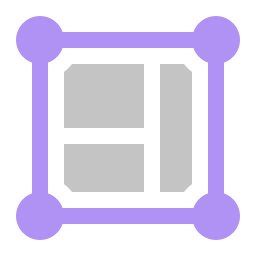 | `d_SpriteAtlas Icon`|
|  | `d_SpriteAtlas On Icon`|
|  | `d_SpriteShapeRenderer Icon`|
|  | `SpriteAtlas Icon`|
|  | `SpriteAtlas On Icon`|
|  | `SpriteShapeRenderer Icon`|
|  | `AspectRatioFitter Icon`|
|  | `Button Icon`|
|  | `CanvasScaler Icon`|
|  | `ContentSizeFitter Icon`|
|  | `d_AspectRatioFitter Icon`|
|  | `d_Button Icon`|
|  | `d_CanvasScaler Icon`|
|  | `d_ContentSizeFitter Icon`|
|  | `d_Dropdown Icon`|
|  | `d_FreeformLayoutGroup Icon`|
|  | `d_GraphicRaycaster Icon`|
|  | `d_Image Icon`|
|  | `d_InputField Icon`|
|  | `d_LayoutElement Icon`|
|  | `d_Mask Icon`|
|  | `d_Outline Icon`|
|  | `d_PhysicalResolution Icon`|
|  | `d_PositionAsUV1 Icon`|
|  | `d_RawImage Icon`|
|  | `d_RectMask2D Icon`|
|  | `d_Scrollbar Icon`|
|  | `d_ScrollRect Icon`|
|  | `d_ScrollViewArea Icon`|
|  | `d_Selectable Icon`|
|  | `d_SelectionList Icon`|
|  | `d_SelectionListItem Icon`|
|  | `d_SelectionListTemplate Icon`|
|  | `d_Shadow Icon`|
|  | `d_Slider Icon`|
|  | `d_Text Icon`|
|  | `d_Toggle Icon`|
|  | `d_ToggleGroup Icon`|
|  | `Dropdown Icon`|
|  | `FreeformLayoutGroup Icon`|
|  | `GraphicRaycaster Icon`|
|  | `GridLayoutGroup Icon`|
|  | `Image Icon`|
|  | `InputField Icon`|
| 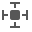 | `LayoutElement Icon`|
|  | `Mask Icon`|
|  | `Outline Icon`|
|  | `PositionAsUV1 Icon`|
|  | `RawImage Icon`|
|  | `RectMask2D Icon`|
|  | `Scrollbar Icon`|
|  | `ScrollRect Icon`|
|  | `Selectable Icon`|
|  | `Shadow Icon`|
|  | `Slider Icon`|
|  | `Text Icon`|
|  | `Toggle Icon`|
|  | `ToggleGroup Icon`|
|   | `VerticalLayoutGroup Icon` `VerticalLayoutGroup Icon`|
|  | `d_PanelSettings Icon`|
|  | `d_PanelSettings On Icon`|
|  | `d_StyleSheet Icon`|
|  | `d_ThemeStyleSheet Icon`|
|  | `d_UIDocument Icon`|
|  | `d_VisualTreeAsset Icon`|
|  | `PanelSettings Icon`|
|  | `PanelSettings On Icon`|
|  | `StyleSheet Icon`|
|  | `ThemeStyleSheet Icon`|
|  | `UIDocument Icon`|
|  | `VisualTreeAsset Icon`|
|  | `d_VisualEffect Icon`|
|  | `d_VisualEffectAsset Icon`|
|   | `VisualEffect Icon` `VisualEffect Icon`|
|    | `VisualEffectAsset Icon` `VisualEffectAsset Icon` `VisualEffectAsset Icon`|
|  | `d_VideoPlayer Icon`|
|  | `VideoClip Icon`|
|  | `VideoPlayer Icon`|
|  | `WheelCollider Icon`|
|  | `WheelJoint2D Icon`|
|  | `WindZone Icon`|
|  | `d_SpatialMappingCollider Icon`|
|  | `SpatialMappingCollider Icon`|
|  | `SpatialMappingRenderer Icon`|
|  | `UssScript Icon`|
|  | `UxmlScript Icon`|
|  | `VideoEffect Icon`|
|  | `VisualEffect Gizmo`|
| 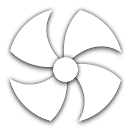 | `WindZone Gizmo`|
|   | `Profiler.AssetLoading` `Profiler.AssetLoading@2x`|
|   | `Profiler.Audio` `Profiler.Audio@2x`|
|   | `Profiler.CPU` `Profiler.CPU@2x`|
|   | `Profiler.Custom` `Profiler.Custom@2x`|
|   | `Profiler.FileAccess` `Profiler.FileAccess@2x`|
|  | `Profiler.FirstFrame`|
|   | `Profiler.GlobalIllumination` `Profiler.GlobalIllumination@2x`|
|   | `Profiler.GPU` `Profiler.GPU@2x`|
|  | `Profiler.Instrumentation`|
|  | `Profiler.LastFrame`|
|   | `Profiler.Memory` `Profiler.Memory@2x`|
|   | `Profiler.NetworkMessages` `Profiler.NetworkMessages@2x`|
|   | `Profiler.NetworkOperations` `Profiler.NetworkOperations@2x`|
|  | `Profiler.NextFrame`|
|    | `Profiler.Open` `Profiler.Open@2x` `Profiler.Open@4x`|
|   | `Profiler.Physics` `Profiler.Physics@2x`|
|   | `Profiler.Physics2D` `Profiler.Physics2D@2x`|
|  | `Profiler.PrevFrame`|
|  | `Profiler.Record`|
|   | `Profiler.Rendering` `Profiler.Rendering@2x`|
|   | `Profiler.UI` `Profiler.UI@2x`|
|   | `Profiler.UIDetails` `Profiler.UIDetails@2x`|
|   | `Profiler.Video` `Profiler.Video@2x`|
|   | `Profiler.VirtualTexturing` `Profiler.VirtualTexturing@2x`|
|  | `ProfilerColumn.WarningCount`|
|   | `Progress` `Progress@2x`|
|   | `Project` `Project@2x`|
|   | `d_PBrowserPackagesNotVisible` `d_PBrowserPackagesNotVisible@2x`|
|   | `d_PBrowserPackagesVisible On` `d_PBrowserPackagesVisible On@2x`|
|   | `d_PBrowserPackagesVisible` `d_PBrowserPackagesVisible@2x`|
|   | `d_PBrowserPackagesVisible_hover` `d_PBrowserPackagesVisible_hover@2x`|
|   | `PBrowserPackagesNotVisible On` `PBrowserPackagesNotVisible On@2x`|
|   | `PBrowserPackagesNotVisible` `PBrowserPackagesNotVisible@2x`|
|   | `PBrowserPackagesVisible` `PBrowserPackagesVisible@2x`|
|   | `PBrowserPackagesVisible_hover` `PBrowserPackagesVisible_hover@2x`|
|   | `AssetLabelIconSquare` `AssetLabelIconSquare@2x`|
|   | `d_AssetLabelIconSquare` `d_AssetLabelIconSquare@2x`|
|   | `d_GridView On` `d_GridView On@2x`|
|   | `d_GridView` `d_GridView@2x`|
|   | `d_Help` `d_Help@2x`|
|   | `d_ListView On` `d_ListView On@2x`|
|   | `d_ListView` `d_ListView@2x`|
|   | `d_more` `d_more@2x`|
|   | `d_SearchWindow` `d_SearchWindow@2x`|
|   | `d_SyncSearch On` `d_SyncSearch On@2x`|
|   | `d_SyncSearch` `d_SyncSearch@2x`|
|   | `d_TableView On` `d_TableView On@2x`|
|   | `d_TableView` `d_TableView@2x`|
|   | `GridView On` `GridView On@2x`|
|   | `GridView` `GridView@2x`|
|   | `Help` `Help@2x`|
|   | `ListView On` `ListView On@2x`|
|   | `ListView` `ListView@2x`|
|   | `more` `more@2x`|
|  | `package_installed`|
|  | `package_update`|
|  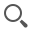 | `SearchWindow` `SearchWindow@2x`|
|   | `SyncSearch On` `SyncSearch On@2x`|
|   | `SyncSearch` `SyncSearch@2x`|
|   | `TableView On` `TableView On@2x`|
|   | `TableView` `TableView@2x`|
|   | `Record Off` `Record Off@2x`|
|   | `Record On` `Record On@2x`|
|   | `RectTool On` `RectTool On@2x`|
|   | `RectTool` `RectTool@2x`|
|  | `RectTransformBlueprint`|
|  | `RectTransformRaw`|
|  | `redGroove`|
|   | `ReflectionProbeSelector` `ReflectionProbeSelector@2x`|
|   | `RepaintDot` `RepaintDot@2x`|
|  | `rightBracket`|
|   | `RotateTool On` `RotateTool On@2x`|
|    | `RotateTool` `RotateTool@2x` `RotateTool@4x`|
|  | `SaveActive`|
|   | `SaveAs` `SaveAs@2x`|
|  | `SaveFromPlay`|
|  | `SavePassive`|
|   | `ScaleTool On` `ScaleTool On@2x`|
|   | `ScaleTool` `ScaleTool@2x`|
|   | `Scene` `Scene@2x`|
|  | `SceneLoadIn`|
|  | `SceneLoadOut`|
|   | `scenepicking_notpickable-mixed` `scenepicking_notpickable-mixed@2x`|
|   | `scenepicking_notpickable-mixed_hover` `scenepicking_notpickable-mixed_hover@2x`|
|   | `scenepicking_notpickable` `scenepicking_notpickable@2x`|
|   | `scenepicking_notpickable_hover` `scenepicking_notpickable_hover@2x`|
|   | `scenepicking_pickable-mixed` `scenepicking_pickable-mixed@2x`|
|   | `scenepicking_pickable-mixed_hover` `scenepicking_pickable-mixed_hover@2x`|
|   | `scenepicking_pickable` `scenepicking_pickable@2x`|
|   | `scenepicking_pickable_hover` `scenepicking_pickable_hover@2x`|
|  | `SceneSave`|
|  | `SceneSaveGrey`|
|  | `2d-badge-scene-template`|
|  | `3d-badge-scene-template`|
|   | `pin` `pin@2x`|
|   | `pinned` `pinned@2x`|
| 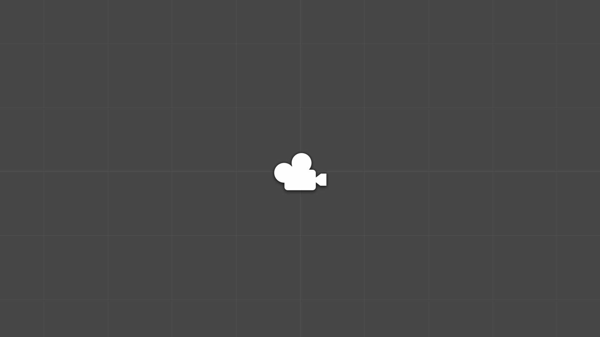 | `scene-template-2d-scene`|
| 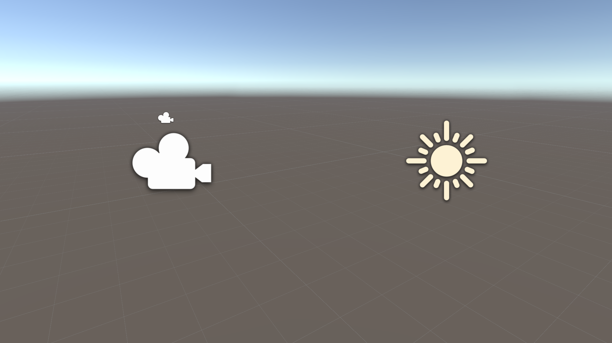 | `scene-template-3d-scene`|
|  | `scene-template-dark`|
| 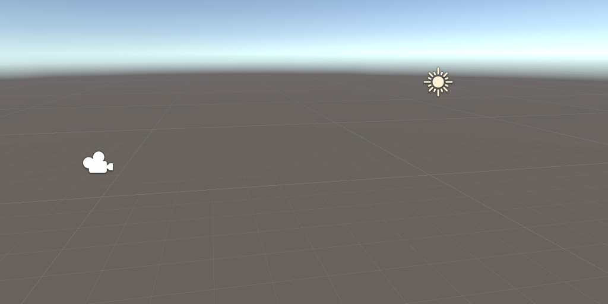 | `scene-template-default-scene`|
|  | `scene-template-empty-scene`|
|  | `scene-template-light`|
|  | `scene-template`|
|   | `SceneView2D On` `SceneView2D On@2x`|
|   | `SceneView2D` `SceneView2D@2x`|
|  | `SceneViewAlpha`|
|   | `SceneViewAudio On` `SceneViewAudio On@2x`|
|   | `SceneViewAudio` `SceneViewAudio@2x`|
|   | `SceneViewCamera On` `SceneViewCamera On@2x`|
|   | `SceneViewCamera` `SceneViewCamera@2x`|
|  | `SceneViewFx On`|
|  | `SceneViewFX On@2x`|
|  | `SceneViewFx`|
|  | `SceneViewFX@2x`|
|   | `SceneViewLighting On` `SceneViewLighting On@2x`|
|   | `SceneViewLighting` `SceneViewLighting@2x`|
|  | `SceneViewOrtho`|
|  | `SceneViewRGB`|
|   | `SceneViewTools On` `SceneViewTools On@2x`|
|   | `SceneViewTools` `SceneViewTools@2x`|
|   | `SceneViewVisibility On` `SceneViewVisibility On@2x`|
|   | `SceneViewVisibility` `SceneViewVisibility@2x`|
|   | `scenevis_hidden-mixed` `scenevis_hidden-mixed@2x`|
|   | `scenevis_hidden-mixed_hover` `scenevis_hidden-mixed_hover@2x`|
|   | `scenevis_hidden` `scenevis_hidden@2x`|
|   | `scenevis_hidden_hover` `scenevis_hidden_hover@2x`|
|   | `scenevis_scene_hover` `scenevis_scene_hover@2x`|
|   | `scenevis_visible-mixed` `scenevis_visible-mixed@2x`|
|   | `scenevis_visible-mixed_hover` `scenevis_visible-mixed_hover@2x`|
|   | `scenevis_visible` `scenevis_visible@2x`|
|   | `scenevis_visible_hover` `scenevis_visible_hover@2x`|
|  | `ScrollShadow`|
|   | `Settings` `Settings@2x`|
|   | `SettingsIcon` `SettingsIcon@2x`|
|   | `alertDialog` `alertDialog@2x`|
|   | `conflict-icon` `conflict-icon@2x`|
|  | `ShowPanels`|
|   | `d_GridAxisX On` `d_GridAxisX On@2x`|
|   | `d_GridAxisX` `d_GridAxisX@2x`|
|   | `d_GridAxisY On` `d_GridAxisY On@2x`|
|   | `d_GridAxisY` `d_GridAxisY@2x`|
|   | `d_GridAxisZ On` `d_GridAxisZ On@2x`|
|   | `d_GridAxisZ` `d_GridAxisZ@2x`|
|   | `d_SceneViewSnap On` `d_SceneViewSnap On@2x`|
|   | `d_SceneViewSnap` `d_SceneViewSnap@2x`|
|   | `d_SnapIncrement` `d_SnapIncrement@2x`|
|   | `GridAxisX On` `GridAxisX On@2x`|
|   | `GridAxisX` `GridAxisX@2x`|
|   | `GridAxisY On` `GridAxisY On@2x`|
|   | `GridAxisY` `GridAxisY@2x`|
|   | `GridAxisZ On` `GridAxisZ On@2x`|
|   | `GridAxisZ` `GridAxisZ@2x`|
|   | `SceneViewSnap On` `SceneViewSnap On@2x`|
|   | `SceneViewSnap` `SceneViewSnap@2x`|
|   | `SnapIncrement` `SnapIncrement@2x`|
|  | `SocialNetworks.FacebookShare`|
|  | `SocialNetworks.LinkedInShare`|
|  | `SocialNetworks.Tweet`|
|  | `SocialNetworks.UDNLogo`|
|  | `SocialNetworks.UDNOpen`|
|  | `SoftlockInline`|
|  | `SpeedScale`|
|  | `StateMachineEditor.ArrowTip`|
|  | `StateMachineEditor.ArrowTipSelected`|
| 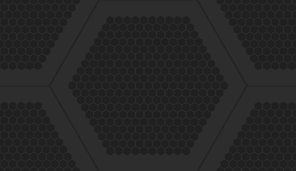 | `StateMachineEditor.Background`|
|  | `StateMachineEditor.State`|
|  | `StateMachineEditor.StateHover`|
|  | `StateMachineEditor.StateSelected`|
|  | `StateMachineEditor.StateSub`|
|  | `StateMachineEditor.StateSubHover`|
|  | `StateMachineEditor.StateSubSelected`|
|  | `StateMachineEditor.UpButton`|
|  | `StateMachineEditor.UpButtonHover`|
|   | `StepButton On` `StepButton On@2x`|
|   | `StepButton` `StepButton@2x`|
|  | `StepLeftButton-On`|
|  | `StepLeftButton`|
|  | `sv_icon_dot0_sml`|
|  | `sv_icon_dot10_sml`|
|  | `sv_icon_dot11_sml`|
|  | `sv_icon_dot12_sml`|
|  | `sv_icon_dot13_sml`|
|  | `sv_icon_dot14_sml`|
|  | `sv_icon_dot15_sml`|
|  | `sv_icon_dot1_sml`|
|  | `sv_icon_dot2_sml`|
|  | `sv_icon_dot3_sml`|
|  | `sv_icon_dot4_sml`|
|  | `sv_icon_dot5_sml`|
|  | `sv_icon_dot6_sml`|
|  | `sv_icon_dot7_sml`|
|  | `sv_icon_dot8_sml`|
|  | `sv_icon_dot9_sml`|
|  | `sv_icon_name0`|
|  | `sv_icon_name1`|
|  | `sv_icon_name2`|
|  | `sv_icon_name3`|
|  | `sv_icon_name4`|
|  | `sv_icon_name5`|
|  | `sv_icon_name6`|
|  | `sv_icon_name7`|
|  | `sv_icon_none`|
|  | `sv_label_0`|
|  | `sv_label_1`|
|  | `sv_label_2`|
|  | `sv_label_3`|
|  | `sv_label_4`|
|  | `sv_label_5`|
|  | `sv_label_6`|
|  | `sv_label_7`|
|   | `tab_next` `tab_next@2x`|
|   | `tab_prev` `tab_prev@2x`|
|  | `TabToFilter`|
|   | `TerrainInspector.TerrainToolAdd` `TerrainInspector.TerrainToolAdd@2x`|
|  | `TerrainInspector.TerrainToolLower On`|
|  | `TerrainInspector.TerrainToolLower`|
|  | `TerrainInspector.TerrainToolLowerAlt`|
|  | `TerrainInspector.TerrainToolPlants On`|
|   | `TerrainInspector.TerrainToolPlants` `TerrainInspector.TerrainToolPlants@2x`|
|  | `TerrainInspector.TerrainToolPlantsAlt On`|
|  | `TerrainInspector.TerrainToolPlantsAlt`|
|  | `TerrainInspector.TerrainToolRaise On`|
|  | `TerrainInspector.TerrainToolRaise`|
|  | `TerrainInspector.TerrainToolSculpt On`|
|  | `TerrainInspector.TerrainToolSculpt`|
|  | `TerrainInspector.TerrainToolSetheight On`|
|  | `TerrainInspector.TerrainToolSetheight`|
|  | `TerrainInspector.TerrainToolSetheightAlt On`|
|  | `TerrainInspector.TerrainToolSetheightAlt`|
|  | `TerrainInspector.TerrainToolSettings On`|
|   | `TerrainInspector.TerrainToolSettings` `TerrainInspector.TerrainToolSettings@2x`|
|  | `TerrainInspector.TerrainToolSmoothHeight On`|
|  | `TerrainInspector.TerrainToolSmoothHeight`|
|  | `TerrainInspector.TerrainToolSplat On`|
|   | `TerrainInspector.TerrainToolSplat` `TerrainInspector.TerrainToolSplat@2x`|
|  | `TerrainInspector.TerrainToolSplatAlt On`|
|  | `TerrainInspector.TerrainToolSplatAlt`|
|  | `TerrainInspector.TerrainToolTrees On`|
|   | `TerrainInspector.TerrainToolTrees` `TerrainInspector.TerrainToolTrees@2x`|
|  | `TerrainInspector.TerrainToolTreesAlt On`|
|  | `TerrainInspector.TerrainToolTreesAlt`|
|  | `TestFailed`|
|  | `TestIgnored`|
|  | `TestInconclusive`|
|  | `TestNormal`|
|  | `TestPassed`|
|  | `TestStopwatch`|
|   | `Texture2DArray On` `Texture2DArray On@2x`|
|   | `Texture2DArray` `Texture2DArray@2x`|
|   | `toggle_searcher_preview_off` `toggle_searcher_preview_off@2x`|
|   | `toggle_searcher_preview_on` `toggle_searcher_preview_on@2x`|
|   | `ToggleUVOverlay` `ToggleUVOverlay@2x`|
|   | `Toolbar Minus` `Toolbar Minus@2x`|
|   | `Toolbar Plus More` `Toolbar Plus More@2x`|
|   | `Toolbar Plus` `Toolbar Plus@2x`|
|   | `d_debug` `d_debug@2x`|
|   | `d_ObjectMode` `d_ObjectMode@2x`|
|   | `d_SceneViewTools On` `d_SceneViewTools On@2x`|
|   | `d_Shaded` `d_Shaded@2x`|
|   | `d_ShadedWireframe` `d_ShadedWireframe@2x`|
|   | `d_wireframe` `d_wireframe@2x`|
|   | `debug On` `debug On@2x`|
|   | `debug` `debug@2x`|
|   | `ObjectMode` `ObjectMode@2x`|
|   | `Shaded` `Shaded@2x`|
|   | `ShadedWireframe` `ShadedWireframe@2x`|
|   | `wireframe` `wireframe@2x`|
|   | `ToolHandleCenter` `ToolHandleCenter@2x`|
|   | `ToolHandleGlobal` `ToolHandleGlobal@2x`|
|   | `ToolHandleLocal` `ToolHandleLocal@2x`|
|   | `ToolHandlePivot` `ToolHandlePivot@2x`|
|  | `ToolsIcon`|
|  | `tranp`|
|   | `TransformTool On` `TransformTool On@2x`|
|   | `TransformTool` `TransformTool@2x`|
|  | `tree_icon`|
| 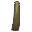 | `tree_icon_branch`|
|  | `tree_icon_branch_frond`|
|  | `tree_icon_frond`|
|  | `tree_icon_leaf`|
|  | `TreeEditor.AddBranches`|
|  | `TreeEditor.AddLeaves`|
|  | `TreeEditor.Branch On`|
|  | `TreeEditor.Branch`|
|  | `TreeEditor.BranchFreeHand On`|
|  | `TreeEditor.BranchFreeHand`|
|  | `TreeEditor.BranchRotate On`|
|  | `TreeEditor.BranchRotate`|
|  | `TreeEditor.BranchScale On`|
|  | `TreeEditor.BranchScale`|
|  | `TreeEditor.BranchTranslate On`|
|  | `TreeEditor.BranchTranslate`|
|  | `TreeEditor.Distribution On`|
|  | `TreeEditor.Distribution`|
|  | `TreeEditor.Duplicate`|
|  | `TreeEditor.Geometry On`|
|  | `TreeEditor.Geometry`|
|  | `TreeEditor.Leaf On`|
|  | `TreeEditor.Leaf`|
|  | `TreeEditor.LeafFreeHand On`|
|  | `TreeEditor.LeafFreeHand`|
|  | `TreeEditor.LeafRotate On`|
|  | `TreeEditor.LeafRotate`|
|  | `TreeEditor.LeafScale On`|
|  | `TreeEditor.LeafScale`|
|  | `TreeEditor.LeafTranslate On`|
|  | `TreeEditor.LeafTranslate`|
|  | `TreeEditor.Material On`|
|  | `TreeEditor.Material`|
|  | `TreeEditor.Refresh`|
|  | `TreeEditor.Trash`|
|  | `TreeEditor.Wind On`|
|  | `TreeEditor.Wind`|
|   | `UndoHistory` `UndoHistory@2x`|
|   | `UnityEditor.AnimationWindow` `UnityEditor.AnimationWindow@2x`|
|   | `UnityEditor.ConsoleWindow` `UnityEditor.ConsoleWindow@2x`|
|  | `UnityEditor.DebugInspectorWindow`|
|   | `UnityEditor.DeviceSimulation.SimulatorWindow` `UnityEditor.DeviceSimulation.SimulatorWindow@2x`|
|  | `UnityEditor.FindDependencies`|
|   | `UnityEditor.GameView` `UnityEditor.GameView@2x`|
|   | `UnityEditor.Graphs.AnimatorControllerTool` `UnityEditor.Graphs.AnimatorControllerTool@2x`|
|   | `UnityEditor.HierarchyWindow` `UnityEditor.HierarchyWindow@2x`|
|   | `UnityEditor.HistoryWindow` `UnityEditor.HistoryWindow@2x`|
|   | `UnityEditor.InspectorWindow` `UnityEditor.InspectorWindow@2x`|
|   | `UnityEditor.ProfilerWindow` `UnityEditor.ProfilerWindow@2x`|
|   | `UnityEditor.SceneHierarchyWindow` `UnityEditor.SceneHierarchyWindow@2x`|
|   | `UnityEditor.SceneView` `UnityEditor.SceneView@2x`|
|   | `UnityEditor.Timeline.TimelineWindow` `UnityEditor.Timeline.TimelineWindow@2x`|
|   | `UnityEditor.VersionControl` `UnityEditor.VersionControl@2x`|
|  | `UnityLogo`|
|  | `UnityLogoLarge`|
|   | `UnLinked` `UnLinked@2x`|
|  | `UpArrow`|
|   | `Valid` `Valid@2x`|
|   | `d_File` `d_File@2x`|
|   | `d_Incoming Icon` `d_Incoming Icon@2x`|
|  | `d_Outgoing Icon@`|
|  | `d_Outgoing Icon@2x`|
|   | `d_P4_AddedLocal` `d_P4_AddedLocal@2x`|
|   | `d_P4_AddedRemote` `d_P4_AddedRemote@2x`|
|   | `d_P4_BlueLeftParenthesis` `d_P4_BlueLeftParenthesis@2x`|
| 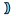  | `d_P4_BlueRightParenthesis` `d_P4_BlueRightParenthesis@2x`|
|   | `d_P4_CheckOutLocal` `d_P4_CheckOutLocal@2x`|
|   | `d_P4_CheckOutRemote` `d_P4_CheckOutRemote@2x`|
|   | `d_P4_Conflicted` `d_P4_Conflicted@2x`|
|   | `d_P4_DeletedLocal` `d_P4_DeletedLocal@2x`|
|   | `d_P4_DeletedRemote` `d_P4_DeletedRemote@2x`|
|   | `d_P4_Local` `d_P4_Local@2x`|
|   | `d_P4_LockedLocal` `d_P4_LockedLocal@2x`|
|   | `d_P4_LockedRemote` `d_P4_LockedRemote@2x`|
|   | `d_P4_Offline` `d_P4_Offline@2x`|
|   | `d_P4_OutOfSync` `d_P4_OutOfSync@2x`|
|   | `d_P4_RedLeftParenthesis` `d_P4_RedLeftParenthesis@2x`|
|   | `d_P4_RedRightParenthesis` `d_P4_RedRightParenthesis@2x`|
|   | `d_P4_Updating` `d_P4_Updating@2x`|
|   | `File` `File@2x`|
|   | `Incoming Icon` `Incoming Icon@2x`|
|   | `Incoming On Icon` `Incoming On Icon@2x`|
|   | `Outgoing Icon` `Outgoing Icon@2x`|
|   | `P4_AddedLocal` `P4_AddedLocal@2x`|
|   | `P4_AddedRemote` `P4_AddedRemote@2x`|
|   | `P4_BlueLeftParenthesis` `P4_BlueLeftParenthesis@2x`|
|   | `P4_BlueRightParenthesis` `P4_BlueRightParenthesis@2x`|
|   | `P4_CheckOutLocal` `P4_CheckOutLocal@2x`|
|   | `P4_CheckOutRemote` `P4_CheckOutRemote@2x`|
|   | `P4_Conflicted` `P4_Conflicted@2x`|
|   | `P4_DeletedLocal` `P4_DeletedLocal@2x`|
|   | `P4_DeletedRemote` `P4_DeletedRemote@2x`|
|   | `P4_Local` `P4_Local@2x`|
|   | `P4_LockedLocal` `P4_LockedLocal@2x`|
|   | `P4_LockedRemote` `P4_LockedRemote@2x`|
|   | `P4_Offline` `P4_Offline@2x`|
|   | `P4_OutOfSync` `P4_OutOfSync@2x`|
|   | `P4_RedLeftParenthesis` `P4_RedLeftParenthesis@2x`|
|   | `P4_RedRightParenthesis` `P4_RedRightParenthesis@2x`|
|   | `P4_Updating` `P4_Updating@2x`|
|  | `VerticalSplit`|
|   | `ViewToolMove On` `ViewToolMove On@2x`|
|   | `ViewToolMove` `ViewToolMove@2x`|
|   | `ViewToolOrbit On` `ViewToolOrbit On@2x`|
|   | `ViewToolOrbit` `ViewToolOrbit@2x`|
|   | `ViewToolZoom On` `ViewToolZoom On@2x`|
|   | `ViewToolZoom` `ViewToolZoom@2x`|
|  | `VisibilityOff`|
|  | `VisibilityOn`|
|   | `VisualQueryBuilder` `VisualQueryBuilder@2x`|
|  | `VUMeterTextureHorizontal`|
|  | `VUMeterTextureVertical`|
|  | `WaitSpin00`|
|  | `WaitSpin01`|
|  | `WaitSpin02`|
|  | `WaitSpin03`|
|  | `WaitSpin04`|
|  | `WaitSpin05`|
|  | `WaitSpin06`|
|  | `WaitSpin07`|
|  | `WaitSpin08`|
|  | `WaitSpin09`|
|  | `WaitSpin10`|
|  | `WaitSpin11`|
|  | `WelcomeScreen.AssetStoreLogo`|
|  | `winbtn_graph`|
|  | `winbtn_graph_close_h`|
|  | `winbtn_graph_max_h`|
|  | `winbtn_graph_min_h`|
|   | `winbtn_mac_close` `winbtn_mac_close@2x`|
|   | `winbtn_mac_close_a` `winbtn_mac_close_a@2x`|
|   | `winbtn_mac_close_h` `winbtn_mac_close_h@2x`|
|   | `winbtn_mac_inact` `winbtn_mac_inact@2x`|
|   | `winbtn_mac_max` `winbtn_mac_max@2x`|
|   | `winbtn_mac_max_a` `winbtn_mac_max_a@2x`|
|   | `winbtn_mac_max_h` `winbtn_mac_max_h@2x`|
|   | `winbtn_mac_min` `winbtn_mac_min@2x`|
|   | `winbtn_mac_min_a` `winbtn_mac_min_a@2x`|
|   | `winbtn_mac_min_h` `winbtn_mac_min_h@2x`|
|   | `winbtn_win_close` `winbtn_win_close@2x`|
|   | `winbtn_win_close_a` `winbtn_win_close_a@2x`|
|   | `winbtn_win_close_h` `winbtn_win_close_h@2x`|
|   | `winbtn_win_max` `winbtn_win_max@2x`|
|   | `winbtn_win_max_a` `winbtn_win_max_a@2x`|
|   | `winbtn_win_max_h` `winbtn_win_max_h@2x`|
|  | `winbtn_win_min`|
|  | `winbtn_win_min_a`|
|  | `winbtn_win_min_h`|
|  | `winbtn_win_rest`|
|  | `winbtn_win_rest_a`|
|  | `winbtn_win_rest_h`|
|   | `winbtn_win_restore` `winbtn_win_restore@2x`|
|   | `winbtn_win_restore_a` `winbtn_win_restore_a@2x`|
|   | `winbtn_win_restore_h` `winbtn_win_restore_h@2x`|
